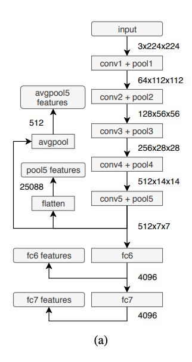
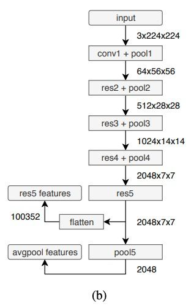
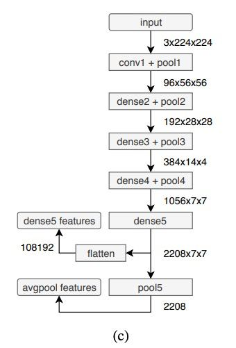
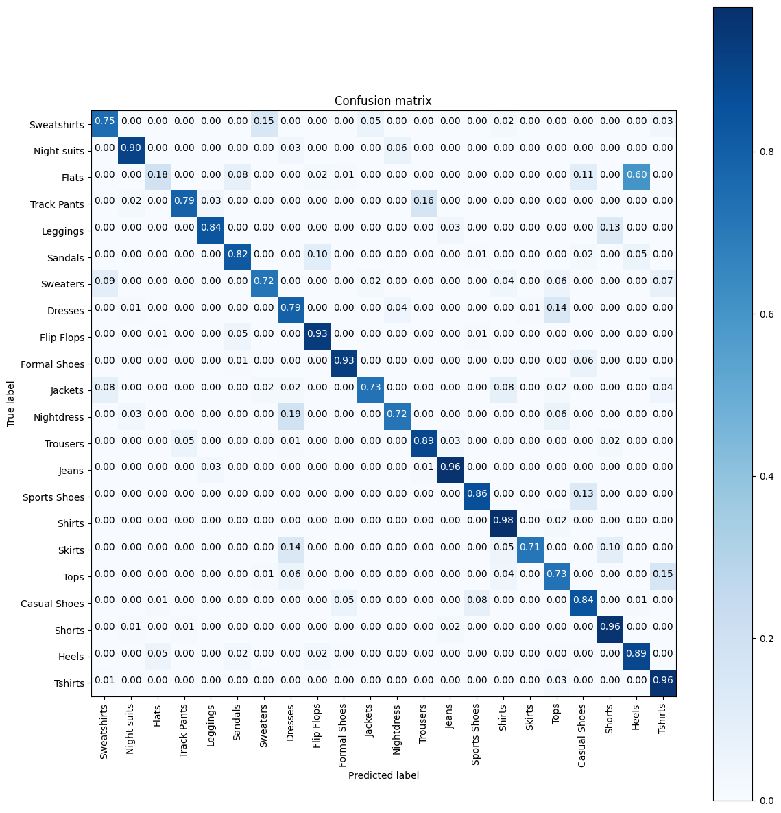
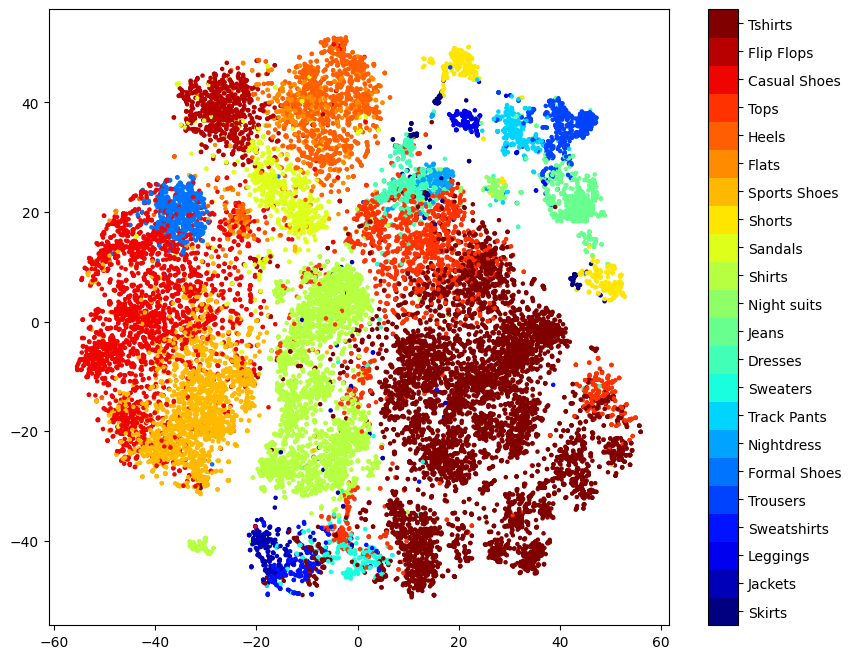
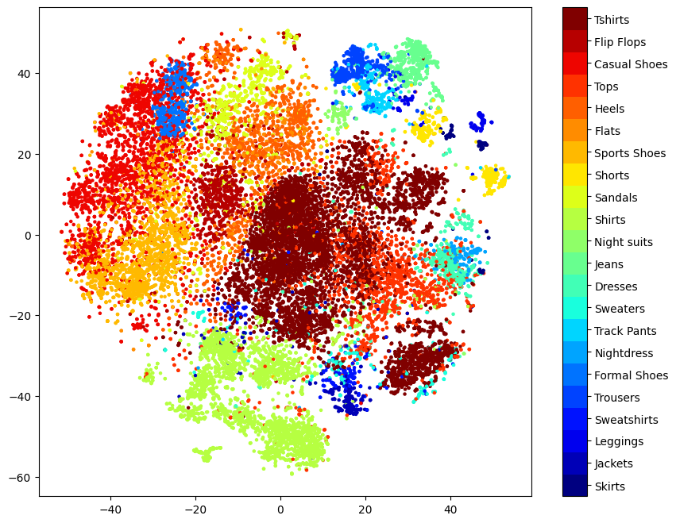
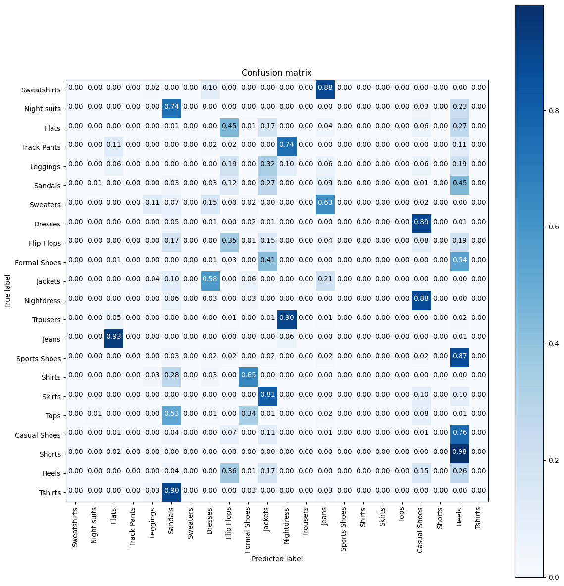
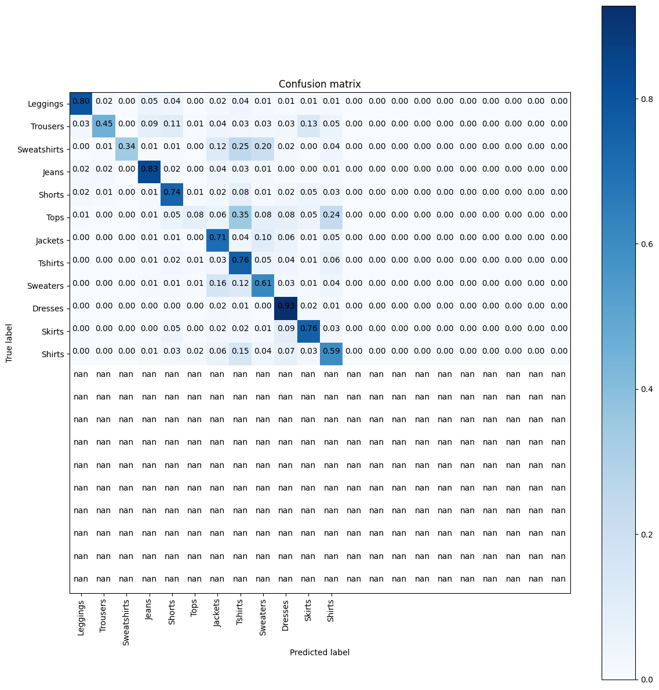

# Deep Learning Image retrieval for Fashion Product database

The aim of the project is the creation of a tool that allows the full implementation and evaluation of an image retrieval web application using the [Fashion Product](https://www.kaggle.com/paramaggarwal/fashion-product-images-dataset) dataset as the database. Several existing pre-trained models are evaluated and also custom models are created from applying Transfer Learning from them.

The main idea is that a user can obtain the topK ranking products more similar to an image using one of the different models available.

The [Deep Fashion](http://mmlab.ie.cuhk.edu.hk/projects/DeepFashion.html) database is used to evaluate the system with more heterogeneous images (real world images) and finally used to conclude which is the best model as it is depicted in the experiments documented.

The original code is the Final Project delivery for the UPC [Artificial Intelligence with Deep Learning Postgraduate Course](https://www.talent.upc.edu/ing/estudis/formacio/curs/310401/postgraduate-course-artificial-intelligence-deep-learning/) 2020-2021 edition, authored by:

* Melania Sánchez
* Jordi Montaner
* Ferran Candela

Advised by professor Kevin McGuinness 

## Deep Learning Retrieval Engine in use

The final application looks like this  


The user can select the image to input, the model to use and also the number of top similar clothes. In this demo you can see how good it behaves with 30 output clothes.


## Project overview

   

Documentation of the different parts of the project:
* [Data preparation](/imageretrieval/README.md/#datapreparation)
* [Training](/imageretrieval/README.md/#training)
* [Model](/imageretrieval/README.md/#model)
* [Feature extraction](/imageretrieval/README.md/#featureextraction)
* [Finetune](/imageretrieval/README.md/#finetune)
* [Evaluation](/imageretrieval/README.md/#evaluation)
* [Feature visualization](/imageretrieval/README.md/#featurevisualization)
* [API](/retrievalapi/README.md)
* [Frontend](/retrieval-app/README.md)

Documentation of the [experiments](#experiments):
1. [Pretrained model](#pretrainedmodel)
2. [Custom model Densenet161](#densenet161custom)
3. [Custom model Densenet161 with PCA finetune](#densenet161custompca)
4. [Evaluation with deep fashion](#evaluationdeepfashion)
5. [Custom model with batchnorm](#custommodelbatchnorm)
6. [Custom model with deep fashion](#custommodeldeepfashion)

## General configuration

### Fashion product dataset

Download from: [https://www.kaggle.com/paramaggarwal/fashion-product-images-dataset/download](https://www.kaggle.com/paramaggarwal/fashion-product-images-dataset/download)

1. Download zip file and name it `Fashion_Product_Full.zip`
2. Create a folder in the repository root with name `datasets/Fashion_Product_Full`
3. Extract the zip inside `datasets/Fashion_Product_Full` so that you have a path like: `{PROJECT_ROOT}/datasets/Fashion_Product_Full/fashion-dataset`
4. It is necessary to remove the following lines in the 'styles.csv' since they are missing images. (We have filters but just in case)

```
39425,Men,Apparel,Topwear,Tshirts,Red,Spring,2013,Casual,U.S. Polo Assn. Men Red Polo T-Shirt
39401,Men,Apparel,Bottomwear,Jeans,Blue,Winter,2016,Casual,U.S. Polo Assn. Denim Co. Men Blue Slim Straight Fit Jeans
12347,Men,Apparel,Topwear,Suits,Red,Winter,2010,Casual,Fastrack Men Red Manhattan Regular Fit Solid Formal Shirt
39403,Men,Apparel,Topwear,Shirts,Black,Summer,2014.0,Casual,U.S. Polo Assn. Men Black Tailored Fit Casual Shirt
39410,Men,Apparel,Topwear,Shirts,Cream,Summer,2014,Casual,U.S. Polo Assn. Men Cream-Coloured Tailored Fit Casual Shirt
```

### Deep fashion dataset

Download from: [https://drive.google.com/drive/folders/0B7EVK8r0v71pekpRNUlMS3Z5cUk](https://drive.google.com/drive/folders/0B7EVK8r0v71pekpRNUlMS3Z5cUk)

1. Download the `img_highres.zip` file.
2. Create a folder in the repository root with name `datasets/DeepFashion/Img`, if necessary.
3. Extract the zip inside `datasets/DeepFashion/Img` so that you have a path like: `{PROJECT_ROOT}/datasets/DeepFashion/Img/img/{folders with images}`


### Install dependencies

Step 1: Get Docker
```
The first step is installing the Docker Engine. Follow the steps in the
official page: 

[https://docs.docker.com/engine/install/](https://docs.docker.com/engine/install/)
```

Step 2: Get Docker Compose
```
Then install Docker Compose. 

[https://docs.docker.com/compose/install/](https://docs.docker.com/compose/install/)
```

## Build project

First of all export the environment variables DATASET_ROOT and WORKDIR_ROOT.

* DATASET_ROOT: environment variable that must point to the Fashion Product dataset root (see main README.md). It should be: ${PROJECT_ROOT}/datasets/Fashion_Product_Full/fashion-dataset
* WORKDIR_ROOT: environment variable that must point to the workdir. It should be: ${PROJECT_ROOT}/dataset/Fashion_Product_Full_Workir
* PROJECT_ROOT: environment variable pointing to the root of the repository.

In the root folder execute:

```
docker-compose -p imageretrieval build
```

This will create the Docker image for the API and the Frontend (that also acts as a proxy for the API in the port 80).

## Execute project

So before, executing the docker-compose up, execute:

```
export PROJECT_ROOT= {POINT TO THE REPOSITORY ROOT}

export DATASET_ROOT=${PROJECT_ROOT}/datasets/Fashion_Product_Full/ && export WORKDIR_ROOT=${PROJECT_ROOT}/datasets/Fashion_Product_Full_Workdir

docker-compose up

```
Then wait until all pretrained models are downloaded and all the created models load from their checkpoints.

# <a name="experiments">Experiments

## <a name="pretrainedmodel"></a>First experiment - Pretrained models
This experiment was the first step of our retrieval engine, we build a system that used pretrained models.
The expectation was to first of all get to know the dataset `product fashion` and train it with pretrained model to be able to identify the best model. Also we took this opportunity to improve the transform operations that we need to apply to the input images to improve the accuracy.
We have performed this experiment over 6 different models:
* vgg16
* resnet50
* inception_v3
* inception_resnet_v2
* densenet161
* efficient_net_b4

</br>

### Hypothesis
The expectation for the first experiment is that resnet50 and DenseNet161 would be the models to behave the best, based on some papers. For example in [this paper](https://www.ingentaconnect.com/contentone/ist/ei/2019/00002019/00000008/art00008?crawler=true&mimetype=application/pdf), resnet, vgg16 and densenet161 are mentioned as the most used models and with better performance. in this paper it is used as texture retrieval, something similar to our clothe retrieval system.

</br>

### Experiment setup
We have use as dataset Product Fashion, you can see a sample of the content in the following table.
id,gender,masterCategory,subCategory,articleType,baseColour,season,year,usage,productDisplayName
| id   | gender |  masterCategory |   subCategory |  articleType  | baseColour   |   season   |  year |   usage |  productDisplayName  |
|------|-------:|----------------:|--------------:|--------------:|-------------:|-----------:|------:|------:|:---------:|
|15970|Men|Apparel|Topwear|Shirts|Navy Blue|Fall|2011|Casual|Turtle Check Men Navy Blue Shirt
|39386|Men|Apparel|Bottomwear|Jeans|Blue|Summer|2012|Casual|Peter England Men Party Blue Jeans|
|59263|Women|Accessories|Watches|Watches|Silver|Winter|2016|Casual|Titan Women Silver Watch|

The architecture of the models we have used is the described on the following documentation pages. We have use `torchvision.model` library.
* [Resnet model](https://pytorch.org/vision/0.8/_modules/torchvision/models/resnet.html)
* [DenseNet model](https://pytorch.org/vision/stable/_modules/torchvision/models/densenet.html)
* [VGG16 model](https://pytorch.org/vision/stable/_modules/torchvision/models/vgg.html)
 
     

   (a) VGG-16, (b) ResNet-50, and (c) DenseNet-161 architectures
and feature extraction locations. 

However we included some customizations based on the results we so for our particular case of clothe retrieval.
* Changes that included in vgg16 model:
   ```
   model.model = nn.Sequential(
      model.model.features,
      nn.AdaptiveAvgPool2d((1,1)),
      nn.Flatten()
   )

   model.output_features = 512
   ```

* Changes that included in resnet50 model:
   ```
   model.model.fc = nn.Identity()

   model.model.layer4[2].relu = nn.Identity()

   model.output_features = 2048
   ```
* Changes that included in densenet161 model:
   ```
   model.model.classifier = nn.Identity()

   model.output_features = 2208
   ```
As you can see we have removed the classification layer fom all of the model in order convert them in feature extractors and also we have included the output_features value after using the feature extractor.

We also included the this transformation for the input data
   ```
   transforms.Compose([
         transforms.Resize(image_resized_size),
         transforms.CenterCrop(image_resized_size),
         transforms.ToTensor(),
         self.normalize
   ])
   ```
Resized images to 224 when using vgg16 and densenet161 and 299 when using inception_v3 and resnet50.
We CenterCrop and then we normalize.

Finally we have ready our transfer learning model.

</br>

### Results

In the following table you can see what are the results based on mAP and precision hit, the results are sorted by precision hit.

As we expected the model that behave the best are densenet161, vgg16, resnet50. And we can also see that inception_v3 is on the top 3 models.
The model that gives best mAP is vgg16 and the model with best precision hit is densenet161.

| Model | DataSetSize | UsedFeatures | FeaturesSize | ProcessTime | mAPqueries | mAP | PrecisionHits |
|-------|------------:|-------------:|-------------:|------------:|-----------:|----:|--------------:|
|densenet161|5021|NormalizedFeatures|128|0:11:15|600|0,256|0,7514|
|vgg16|5021|NormalizedFeatures|128|0:10:25|600|0,293|0,7742|
|resnet50|5021|NormalizedFeatures|128|0:11:04|600|0,221|0,7133|
|inception_v3|5021|NormalizedFeatures|128|0:11:25|600|0,246|0,7016|
|inception_resnet_v2|5021|NormalizedFeatures|128|0:11:45|600|0,187|0,5892|
|efficient_net_b4|5021|NormalizedFeatures|128|0:11:45|600|0,173|0,5293|  

</br>  

### Conclusions

As result we can see that the model that performs the best for our specific use case is densenet161.

Our system is a retrieval engine for clothes when we will show 5, 10 or 15 suggestions to the end user, therefore the precision hit of top 15 is the evaluation metrics that drives our final decision to choose the best model.

</br>

## <a name="densenet161custom"></a>Second experiment - Custom model Densenet161

In this experiment we use DesNet161 model with transfer learning as well, however we will freezing some layers, to be able to retrain them a get better results.
We will use the feature extracted form the pretrained models and then train the classification layer.

Although we will focus our improvements on densenet161 we have perform the comparative for the same model that we have use before:
* vgg16
* resnet50
* inception_v3
* inception_resnet_v2
* densenet161
* efficient_net_b4

### Hypothesis
We expect that the precision hits and the mean average precision (mAP) is going to improve when we train some layer of the transfer learning models that we are using. We expect again that the model that will give a better evaluation is DenseNet161.

### Experiment setup
We have use as dataset Product Fashion, you can see a sample of the content in the previous experiment table.

The architecture of the models in this experiment is slightly different to the one presented in the first experiment. We decided to froze some of the initial layers, so the last layer would be train again by our system. For each of the models:

* **DenseNet161**: we have retrained the layer `denseblock4`, so we freeze the rest of layers from this model.
* **VGG16**: we have retrained from the 24th to the 30th layer, then used same classifier that proposed in vgg16 but with our num_classes as output, and only pass to the optimizers the parameters that require grads.
* **ResNet50**: in this case we have 4 layer so we just train the last layer, the 4th one, the rest of them remain frozen.
* **Inception v3**: in this case we have mixed layers and we decided to train `Mixed_7a`, `Mixed_7b` and `Mixed_7c`, so the rest of the layer would be frozen.

### Results
In the following table you can see what are the results based on mAP and precision hit, the results are sorted by precision hit.

As we expected the model that behave the best are densenet161.
The model that gives best mAP is vgg16 and the model with best precision hit is densenet161.

| Model | DataSetSize | UsedFeatures | FeaturesSize | ProcessTime | mAPqueries | mAP | PrecisionHits |
|-------|------------:|-------------:|-------------:|------------:|-----------:|----:|--------------:|
|densenet161_custom|5021|NormalizedFeatures|128|0:11:15|600|0,310|0,8217|
|resnet50_custom|5021|NormalizedFeatures|128|0:11:42|600|0,225|0,7862|
|vgg16_custom|5021|NormalizedFeatures|44|0:11:06|600|0,401|0,7821|
|inception_v3_custom|5021|NormalizedFeatures|128|0:09:52|600|0,265|0,7797|

We have calculated as well the confusion matrix for the best model to see how it looks. 
Here the confusion matrix for DenseNet161  


As you can appreciate in the matrix the precision is very high for all of the classes, with specific mention to shirt and tshirt.

Also we have created a tsne graph representation of the feature visualization for DesneNet161 in the following image  


We can also appreciate a clear distribution of the features fo the classes that we have in our dataset.

### Conclusions

Again as in the previous result we can see that the model that performs the best for our specific use case is densenet161.

But not only that, we also can see that the evaluation metrics have improved comparing to the previous experiment.

## <a name="densenet161custompca"></a>Third experiment - Custom model with finetune PCA

Principal Components Analysis (PCA) is a mathematical formulation used in the reduction of data dimensions. Thus, the PCA technique allows the identification of standards in data and their expression in such a way that their similarities and differences are emphasized. Once patterns are found, they can be compressed, i.e., their dimensions can be reduced without much loss of information. In summary, the PCA formulation may be used as a digital image compression algorithm with a low level of loss.

[Wikipedia Reference](https://en.wikipedia.org/wiki/Dimensionality_reduction)

### Hypothesis
For features extracted from the models, we perform a post-processing that consists of a normalization and a reduction of the dimensionality. To reduce dimensionality we use the PCA technique.


*[1] Jégou, H., & Chum, O. (2012).
Negative evidences and co occurrences in image retrieval: the benefit of PCA and whitening Lecture Notes in Computer Science, 7573 LNCS (PART 2), 774 787*

In the first experiments we used a `fixed` dimensionality for all models equal to 128.

Principal Component Analysis (PCA) is used for preprocessing. If we remove redundant and unwanted data maybe the models improve.
</br>
</br>

### Experiment setup

We need to analyze the PCA for each model. To achieve this, we have created a procedure that evaluates the different possibilities of PCA(n_components) based on two metrics and choose the best dimesion. (finetune.py)
1. mAP (mean Average Precision)
2. precision Hits (average of the number of correct classes in the ranking returned by each query)
</br>
</br>

### Results

| Model | UsedFeatures | Initial n_component | mAP | PrecisionHits | New n_component calculated | New mAP | New PrecisionHits |
|-------|------------:|-------------:|-------------:|------------:|-----------:|----:|--------------:|
|densenet161_custom|NormalizedFeatures|128|0,310|0,8217|20|0,665|0,8467|
|densenet161_custom|AQEFeatures|128|0,386|0,7872|20|0,692|0,8234|
|vgg16_custom|NormalizedFeatures|128|0,293|0,7742|44|0,401|0,7821|
|vgg16_custom|AQEFeatures|128|0,352|0,6424|44|0,490|0,7930|
</br>


### Conclusions

The PCA finetune has greatly improved the metrics we use to evaluate our models.  
It is necessary to finetune each PCA to find the value of n_component of the PCA and perform the best possible post-processing of the features.

## <a name="evaluationdeepfashion"></a>Fourth experiment - Evaluation for deep fashion

We have been using to train and evaluate the models of our neural network the same dataset, Fashion Product. So we want to use a a different dataset with more realistic images. We have selected Deep Fashion as our second dataset, it is a very famous dataset for clothing retrieval systems.
The structure of this dataset it is different from Fashion Product. So the first thing that we needed to do is prepare the data to ve able to work with it in our system.
You can check this out in the section for [data preparation](/imageretrieval/README.md/#datapreparation) form our documentation.

### Hypothesis
We want to evaluate our models with a different dataset to see if the model is just specialized on our images. We think that the models are going to decrease precision hits and mAP, since the dataset that we are using contains images with white background and with a clear focused on the clothes that is referring to.

### Experiment setup
We have prepared the dataset to match the same structure as Fashion Product dataset. And we have run the evaluation getting a subset of the 
data. We have used 100 clothes from each time of clothe that we have in the new dataset, Deep Fashion.
We have applied the evaluation to the following models:
* densenet161_custom
* vgg16_custom
* vgg16
* densenet161
* inception_v3
* resnet50_custom
* resnet50
* efficient_net_b4

The models just with the transfer learning have not special name and the models with the frozen layers with we have trained some of the layers we have called them `_custom`

### Results
In the following table we will compare sorted by precision hits both the custom and simple models. 

|Model|DataSetSize|UsedFeatures|FeaturesSize|mAPqueries|mAP|PrecisionHits|
|-----|----------:|-----------:|-----------:|---------:|--:|------------:|
|densenet161_custom|1245|NormalizedFeatures|128|1245|0,131|0,267|
|vgg16_custom|1245|NormalizedFeatures|128|1245|0,115|0,216|
|vgg16|1245|NormalizedFeatures|128|1245|0,108|0,211|
|densenet161|1245|NormalizedFeatures|128|1245|0,077|0,192|
|inception_v3|1245|NormalizedFeatures|128|1245|0,073|0,163|
|resnet50_custom|1245|NormalizedFeatures|128|1245|0,063|0,157|
|resnet50|1245|NormalizedFeatures|128|1245|0,061|0,127|
|efficient_net_b4|1245|NormalizedFeatures|128|1245|0,045|0,055|


### Conclusions

From this results we can see that as we expected the models that we have trained does not work for very well for the more realistic data coming from Deep Fashion dataset. DenseNet161 is still the model that performs the best, but the result is not very low. This means that in average it will give as 5 correct result out of the 15 that we show as similar.

Therefore we can say that we need to include more realistic images in the dataset that we use for training.

## <a name="custommodelbatchnorm"></a>Fifth experiment - Custom model batch norm with Deep Fashion dataset

### Hypothesis

As explained in the training section, there is a trick that can be used with pretrained models to make the model match the norm statistics of the target dataset. This is called [Batch normalization](https://en.wikipedia.org/wiki/Batch_normalization).

We wanted to try if using the already pretrained model `densenet161_custom`, with which we obtained pretty good results, and making the pass over the Deep Fashion dataset, without doing any backpropagation, the model generalizes better and obtain better results for both Fashion Product evaluation as well as Deep Fashion evaluation.

### Experiment setup

We need to modify the DATASET_BASE_DIR and DATASET_LABELS_DIR to point the Deep Fashion dataset and the precomputed Deep Fashion labels mapping CSV already used in the Fourth Experiment.

Set up the new model to train in the Model Manager, in this case named as `densenet161_custom_deep_batchnorm`. This model is loading the `densenet161_custom` model, loading their weights, bias and norms. Then a `batch norm training` is executed just passing over the Deep Fashion dataset without propagating gradients. So we are treating this model as the pretrained models in the first experiment.

### Results

1. Evaluation with Fashion Product

   Results ordered by precision.

   |Model|DataSetSize|UsedFeatures|FeaturesSize|mAPqueries|mAP|PrecisionHits|
   |-----|----------:|-----------:|-----------:|---------:|--:|------------:|
   |densenet161_custom_20|5021|NormalizedFeatures|20|600|0,665|0,8467|
   |densenet161_custom_20|5021|AQEFeatures|20|600|0,692|0,8234|
   ...
   |densenet161_custom_deep_batchnorm|5021|NormalizedFeatures|128|600|0,301|0,7282|
   |densenet161_custom_deep_batchnorm|5021|AQEFeatures|128|600|0,320|0,5762|

   As can be seen in the results the model does not perform as well as the custom model finetuned with PCA.

2. Evaluation with Deep Fashion

   Results ordered by precision.

   |Model|DataSetSize|UsedFeatures|FeaturesSize|mAPqueries|mAP|PrecisionHits|
   |-----|----------:|-----------:|-----------:|---------:|--:|------------:|
   |densenet161_custom_20|1245|NormalizedFeatures|20|1245|0,218|0,292|
   |densenet161_custom|1245|NormalizedFeatures|128|1245|0,131|0,267|
   |densenet161_custom_deep_batchnorm|1245|NormalizedFeatures|128|1245|0,114|0,244|
   ...

   The model does not improved neither when using Deep fashion data to evaluate.

### Conclusions

The batch norm trick does not perform as expected in this case, so other models still perform so much better, including the model from which we have begun.

## <a name="custommodeldeepfashion"></a>Sixth experiment - Custom models with Deep Fashion

### Hypothesis

 We know our models are good using images similar to the ones in the Fashion Product database. All are the same size, white background, pretty centered... We want to generalize so for that reason we created the Deep Fashion evaluation that helps us understand if our model generalize in a correct way.

 We know that Deep Fashion product is a more heterogeneous database so we want to use the Deep Fashion data to train the models. We have proposed two options:

 * **Option 1: `densenet161_custom_deep`** <br>
 Do transfer learning with the pretrained model `densenet161` and use the Deep Fashion dataset instead of Fashion Product. We will freeze the same layers than in `densenet161` that we have checked are performing well. So we will the  model. 
 * **Option 2: `densenet161_custom_deep_retrain`** <br>
 Do transfer learning but beginning in the already trained model `densenet161_custom`, that we already seen that performs very well with Fashion Product but still not enough with Deep Fashion dataset.

### Experiment setup

The dataset to use in both cases is the Deep Fashion divided in 60% train, 20% eval and 20% test.

In the first option we created the new model in ModelManager with name `densenet161_custom_deep` and use the same layer freezing than the used to train the `densenet161_custom` model, so we are beginning from the densenet161 pretrained weights.

I the second option, we begin from our custom pretrained model `densenet161_custom` but loading the weights and norms from training it with Fashion Product. After that, retrain the model with the Deep Fashion data to obtain the `densenet161_custom_deep_retrain`.

### Results

Results ordered by precision for Fashion product evaluation.

|Model|DataSetSize|UsedFeatures|FeaturesSize|mAPqueries|mAP|PrecisionHits|
|-----|----------:|-----------:|-----------:|---------:|--:|------------:|
|densenet161_custom|5021|NormalizedFeatures|20|600|0,665|0,8467|
|densenet161_custom|5021|AQEFeatures|20|600|0,692|0,8234|
...
|densenet161_custom_deep|5021|NormalizedFeatures|128|600|0,293|0,7291|
|densenet161_custom_deep|5021|AQEFeatures|128|600|0,336|0,6251|
|densenet161_custom_deep_retrain|5021|NormalizedFeatures|128|600|0,277|0,7037|
|densenet161_custom_deep_retrain|5021|AQEFeatures|128|600|0,339|0,6207|

<br>
We have calculated the confusion matrix and t-SNE for `densenet161_custom_deep` to see how it looks, so the results are not as we expected.<br>

 <br>

 <br>

But calculating the confusion matrix with Deep Fashion we obtained good classification: 

 <br>

Also with `densenet161_custom_deep_retrain` we obtained good classification: 

 <br>

Results ordered by precision for Deep Fashion evaluation.

|Model|DataSetSize|UsedFeatures|FeaturesSize|mAPqueries|mAP|PrecisionHits|
|-----|----------:|-----------:|-----------:|---------:|--:|------------:|
|densenet161_custom_deep|1245|NormalizedFeatures|20|1245|0,136|0,344|
|densenet161_custom_deep|1245|NormalizedFeatures|20|1245|0,124|0,297|
|densenet161_custom_20|1245|NormalizedFeatures|20|1245|0,218|0,292|
|densenet161_custom|1245|NormalizedFeatures|128|1245|0,131|0,267|
|densenet161_custom_deep_batchnorm|1245|NormalizedFeatures|128|1245|0,114|0,244|
...

### Conclusions

As it was expected, the model `densenet161_custom_deep` performs better in Deep Learning evaluation, getting the first position. Although, the model has not a good mAP. In the contrary, this model is below in performance when evaluating it with Fashion Product data.

The model `densenet161_custom_deep_retrain` does not improve the results.

This is suspicious taking into account that the classifier trained with Deep Fashion data classifies with a Test Accuracy of 0,74, so the results must not as bad when evaluating the models with Deep Fashion in comparison with Fashion Product data.

Investigating this situation we discovered that when splitting data in Deep Fashion product, we obtain a different label encoding so for this reason the correlation matrix with Fashion Product looks crazy and so all learned by model in one side is destroyed by the other since the activations are in different places.

# Final conclusions

Unfortunately we do not have more time to fix this error so we still do not know if we can improve significantly the Retrieval Engine using Deep Fashion data.

What we have learned:
* DenseNet161 is the best model when freezing layer and training some of them
* Precision hits is the evaluation metric that fits the best for our use case
* Fine-tuning with PCA improves significantly the results
* The use of AQE it is specially useful when you already have a good precision hit 
* The use of a dataset without real world images makes the model miss important features
* When using a dataset that is simple the number of important features is very low
* Fine tuning is very important and time consuming

# Future work

* Visualizations for units in the last convolutional layer
* Class Activation Map (CAM) / Grad-CAM
* Occlusions
* Test time data augmentation (Data augmentation to the test dataset)
* Graph diffusion (e.g. this [CVPR 2017 paper](https://arxiv.org/abs/1611.05113))
* [Bags of local convolutional features](https://imatge.upc.edu/web/publications/bags-local-convolutional-features-scalable-instance-search)
* Center bias, [saliency weighting](https://github.com/imatge-upc/salbow)
* Regional features (e.g. [RMAC](https://arxiv.org/pdf/1604.01325.pdf))
* Fine tuning the network using triplet loss

Image retrieval is an active research area!

# Bibliography
* Resnet50 diagram from [cv-tricks](https://cv-tricks.com/keras/understand-implement-resnets/)
* [Paper](https://www.ingentaconnect.com/contentone/ist/ei/2019/00002019/00000008/art00008?crawler=true&mimetype=application/pdf) with description of models to use
* [DenseNet model description](https://pytorch.org/hub/pytorch_vision_densenet/)