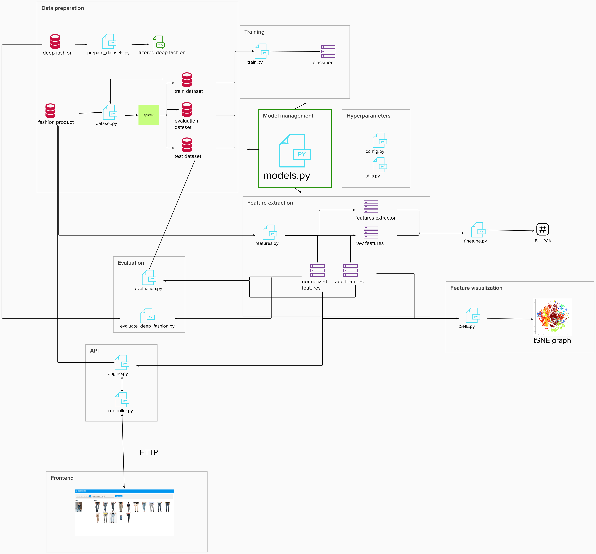

# Deep Learning Image retrieval with Fashion Product database

The aim of the project is the creation of a tool that allows the full implementation and evaluation of an image retrieval web application using the [Fashion Product](https://www.kaggle.com/paramaggarwal/fashion-product-images-dataset) dataset as the database. DuSeveral existing pre-trained models are evaluated and also custom models are created from applying Transfer Learning from them.

The main idea is that a user can obtain the topK ranking products more similar to an image using one of the different models available.

The [Deep Fashion](http://mmlab.ie.cuhk.edu.hk/projects/DeepFashion.html) database is used to evaluate the system with more heterogeneous images (real world images) and finally used to obtain the best model as it is depicted in the evaluation results.

The original code is the Final Project delivery for the UPC [Artificial Intelligence with Deep Learning Postgraduate Course](https://www.talent.upc.edu/ing/estudis/formacio/curs/310401/postgraduate-course-artificial-intelligence-deep-learning/) 2020-2021 edition, authored by:

* Melania Sánchez
* Jordi Montaner
* Ferran Candela

Advised by professor Kevin McGuinness 


## Project overview

   

Documentation of the different parts of the project:
* [Data preparation](/imageretrieval/README.md/#datapreparation)
* [Training](/imageretrieval/README.md/#training)
* [Model](/imageretrieval/README.md/#model)
* [Feature extraction](/imageretrieval/README.md/#featureextraction)
* [Finetune](/imageretrieval/README.md/#finetune)
* [Evaluation](/imageretrieval/README.md/#evaluation)
* [Feature visualization](/imageretrieval/README.md/#featurevisualization)
* [API](/retrievalapi/README.md)
* [Frontend](/retrieval-app/README.md)

Documentation of the [experiments](#experiments):
1. [Pretrained model](#pretrainedmodel)
2. [Custom model Densenet161](#densenet161custom)
3. [Custom model Densenet161 with PCA finetune](#densenet161custompca)
4. [Evaluation with deep fashion](#evaluationdeepfashion)
5. [Custom model with deep fashion](#custommodeldeepfashion)
6. [Custom model with batchnorm](#custommodelbatchnorm)


## General configuration


## Fashion product dataset

It is necessary to remove the following lines in the 'styles.csv' since they are missing images.

```
39425,Men,Apparel,Topwear,Tshirts,Red,Spring,2013,Casual,U.S. Polo Assn. Men Red Polo T-Shirt
39401,Men,Apparel,Bottomwear,Jeans,Blue,Winter,2016,Casual,U.S. Polo Assn. Denim Co. Men Blue Slim Straight Fit Jeans
12347,Men,Apparel,Topwear,Suits,Red,Winter,2010,Casual,Fastrack Men Red Manhattan Regular Fit Solid Formal Shirt
39403,Men,Apparel,Topwear,Shirts,Black,Summer,2014.0,Casual,U.S. Polo Assn. Men Black Tailored Fit Casual Shirt
39410,Men,Apparel,Topwear,Shirts,Cream,Summer,2014,Casual,U.S. Polo Assn. Men Cream-Coloured Tailored Fit Casual Shirt
```

# Install dependencies

Step 1: Get Docker
```
The first step is installing the Docker Engine. Follow the steps in the
official page: 

[https://docs.docker.com/engine/install/](https://docs.docker.com/engine/install/)
```

Step 2: Get Docker Compose
```
Then install Docker Compose. 

[https://docs.docker.com/compose/install/](https://docs.docker.com/compose/install/)
```

# Build project

First of all export the environment variables DATASET_ROOT and WORKDIR_ROOT.


In the root folder execute:

```
docker-compose -p imageretrieval build
```

This will creaate the Docker image for the API and the Frontend (that also acts as a proxy for the API in the port 80).

# <a name="experiments">Experiments

## <a name="pretrainedmodel"></a>First experiment - Pretrained models
This experiment was the first step of our retrieval engine, we build a system that used pretrained models.
The expectation was to first of all get to know the dataset `product fashion` and train it with pretrained model to be able to identify the best model. Also we took this opportunity to improve the transform operations that we need to apply to the input images to improve the accuracy.
We have performed this experiment over 6 different models:
* vgg16
* resnet50
* inception_v3
* inception_resnet_v2
* densenet161
* efficient_net_b4

</br>

### Hypothesis
The expectation for the first experiment is that resnet50 and DenseNet161 would be the models to behave the best, based on some papers. For example in [this paper](https://www.ingentaconnect.com/contentone/ist/ei/2019/00002019/00000008/art00008?crawler=true&mimetype=application/pdf), resnet, vgg16 and densenet161 are mentioned as the most used models and with better performance. in this paper it is used as texture retrieval, something similar to our clothe retrieval system.

</br>

### Experiment setup
We have use as dataset Product Fashion, you have see a sample of the content in the following table.
id,gender,masterCategory,subCategory,articleType,baseColour,season,year,usage,productDisplayName
| id   | gender |  masterCategory |   subCategory |  articleType  | baseColour   |   season   |  year |   usage |  productDisplayName  |
|------|-------:|----------------:|--------------:|--------------:|-------------:|-----------:|------:|------:|:---------:|
|15970|Men|Apparel|Topwear|Shirts|Navy Blue|Fall|2011|Casual|Turtle Check Men Navy Blue Shirt
|39386|Men|Apparel|Bottomwear|Jeans|Blue|Summer|2012|Casual|Peter England Men Party Blue Jeans|
|59263|Women|Accessories|Watches|Watches|Silver|Winter|2016|Casual|Titan Women Silver Watch|
|21379|Men|Apparel|Bottomwear|Track Pants|Black|Fall|2011|Casual|Manchester United Men Solid Black Track Pants|
|53759|Men|Apparel|Topwear|Tshirts|Grey|Summer|2012|Casual|Puma Men Grey T-shirt|
|1855|Men|Apparel|Topwear|Tshirts|Grey|Summer|2011|Casual|Inkfruit Mens Chain Reaction T-shirt|
|30805|Men|Apparel|Topwear|Shirts|Green|Summer|2012|Ethnic|Fabindia Men Striped Green Shirt|
|26960|Women|Apparel|Topwear|Shirts|Purple|Summer|2012|Casual|Jealous 21 Women Purple Shirt|
|29114|Men|Accessories|Socks|Socks|Navy Blue|Summer|2012|Casual|Puma Men Pack of 3 Socks|
|30039|Men|Accessories|Watches|Watches|Black|Winter|2016|Casual|Skagen Men Black Watch|
|9204|Men|Footwear|Shoes|Casual Shoes|Black|Summer|2011|Casual|Puma Men Future Cat Remix SF Black Casual Shoes|
|48123|Women|Accessories|Belts|Belts|Black|Summer|2012|Casual|Fossil Women Black Huarache Weave Belt|
|18653|Men|Footwear|Flip Flops|Flip Flops|Black|Fall|2011|Casual|Fila Men Cush Flex Black Slippers|  

The architecture of the models we have used is the described on the following images. 
    
   
     
   (a) VGG-16, (b) ResNet-50, and (c) DenseNet-161 architectures
and feature extraction locations. 

However we included some customizations based on the results we so for our particular case of clothe retrieval.
* Changes that included in vgg16 model:
   ```
   model.model = nn.Sequential(
      model.model.features,
      nn.AdaptiveAvgPool2d((1,1)),
      nn.Flatten()
   )

   model.output_features = 512
   ```

* Changes that included in resnet50 model:
   ```
   model.model.fc = nn.Identity()

   model.model.layer4[2].relu = nn.Identity()

   model.output_features = 2048
   ```
* Changes that included in densenet161 model:
   ```
   model.model.classifier = nn.Identity()

   model.output_features = 2208
   ```
As you can see we have removed the classification layer fom all of the model in order convert them in feature extractors and also we have included the output_features value after using the feature extractor.

</br>

### Results

In the following table you can see what are the results based on mAP and precision hit, the results are sorted by precision hit.

As we expected the model that behave the best are densenet161, vgg16, resnet50. And we can also see that inception_v3 is on the top 3 models.
The model that gives best mAP is vgg16 and the model with best precision hit is densenet161.

| Model | DataSetSize | UsedFeatures | FeaturesSize | ProcessTime | mAPqueries | mAP | PrecisionHits |
|-------|------------:|-------------:|-------------:|------------:|-----------:|----:|--------------:|
|densenet161|5021|NormalizedFeatures|128|0:11:15|600|0,256|0,7514|
|vgg16|5021|NormalizedFeatures|128|0:10:25|600|0,273|0,7159|
|resnet50|5021|NormalizedFeatures|128|0:11:04|600|0,221|0,7133|
|inception_v3|5021|NormalizedFeatures|128|0:11:25|600|0,246|0,7016|
|inception_resnet_v2|5021|NormalizedFeatures|128|0:11:45|600|0,187|0,5892|
|efficient_net_b4|5021|NormalizedFeatures|128|0:11:45|600|0,173|0,5293|  

</br>  

### Conclusions

As a result we can see that the model that 

</br>

## <a name="densenet161custom">Second experiment - Customer model Densenet161

### Hypothesis
### Experiment setup
### Results
### Conclusions


## <a name="densenet161custompca">Third experiment - Customer model with finetune PCA

Principal Components Analysis (PCA) is a mathematical formulation used in the reduction of data dimensions. Thus, the PCA technique allows the identification of standards in data and their expression in such a way that their similarities and differences are emphasized. Once patterns are found, they can be compressed, i.e., their dimensions can be reduced without much loss of information. In summary, the PCA formulation may be used as a digital image compression algorithm with a low level of loss.

[Wikipedia Reference](https://en.wikipedia.org/wiki/Dimensionality_reduction)

### Hypothesis
For features extracted from the models, we perform a post-processing that consists of a normalization and a reduction of the dimensionality. To reduce dimensionality we use the PCA technique.


*[1] Jégou, H., & Chum, O. (2012).
Negative evidences and co occurrences in image retrieval: the benefit of PCA and whitening Lecture Notes in Computer Science, 7573 LNCS (PART 2), 774 787*

In the first experiments we used a `fixed` dimensionality for all models equal to 128.

Principal Component Analysis (PCA) is used for preprocessing. If we remove redundant and unwanted data maybe the models improve.
</br>
</br>
### Experiment setup

We need to analyze the PCA for each model. To achieve this, we have created a procedure that evaluates the different possibilities of PCA based on two metrics and choose the best dimesion. (finetune.py)
1. mAP (mean Average Precision)
2. precision Hits (average of the number of correct classes in the ranking returned by each query)
</br>
</br>
### Results

| Model | UsedFeatures | Initial n_component | mAP | PrecisionHits | New n_component calculated | New mAP | New PrecisionHits |
|-------|------------:|-------------:|-------------:|------------:|-----------:|----:|--------------:|
|densenet161_custom|NormalizedFeatures|128|0,310|0,8217|20|0,665|0,8467|
|densenet161_custom|AQEFeatures|128|0,386|0,7872|20|0,692|0,8234|
|vgg16_custom|NormalizedFeatures|128|0,401|0,7821|44|0,407|0,7873|
|vgg16_custom|AQEFeatures|128|0,491|0,7930|44|0,483|0,8018|
</br>


### Conclusions

The PCA finetune has greatly improved the metrics we use to evaluate our models.  
It is necessary to finetun each PCA to find the value of n_component of the PCA and perform the best possible post-processing of the features.
## <a name="evaluationdeepfashion">Fourth experiment - Evaluation for deep fashion

### Hypothesis
### Experiment setup
### Results
### Conclusions


## <a name="custommodeldeepfashion">Fifth experiment - Evaluation for deep fashion

### Hypothesis
### Experiment setup
### Results
### Conclusions


## <a name="custommodelbatchnorm">Sixth experiment - Evaluation for deep fashion

### Hypothesis
### Experiment setup
### Results
### Conclusions

# Bibliography
* Resnet50 diagram from [cv-tricks](https://cv-tricks.com/keras/understand-implement-resnets/)