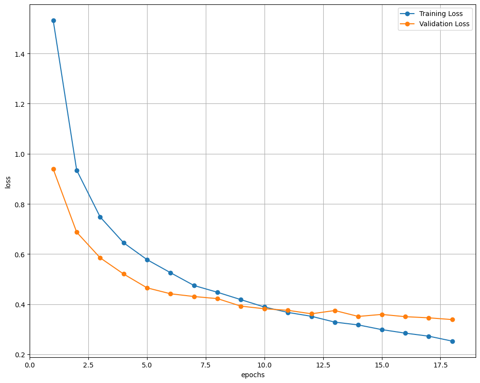
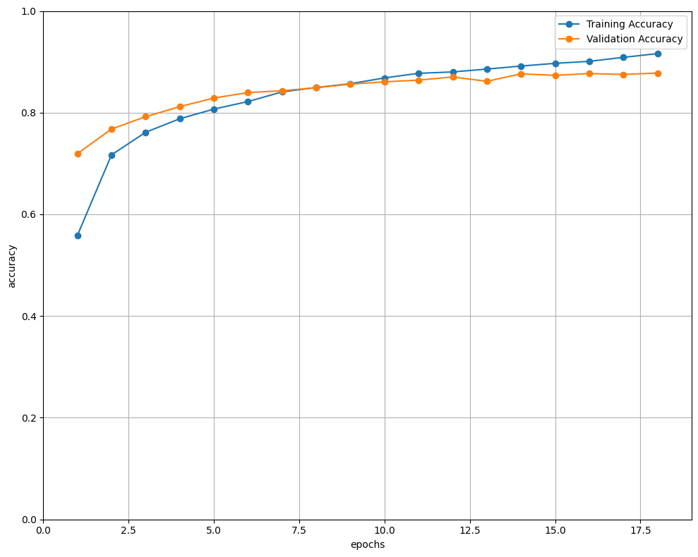
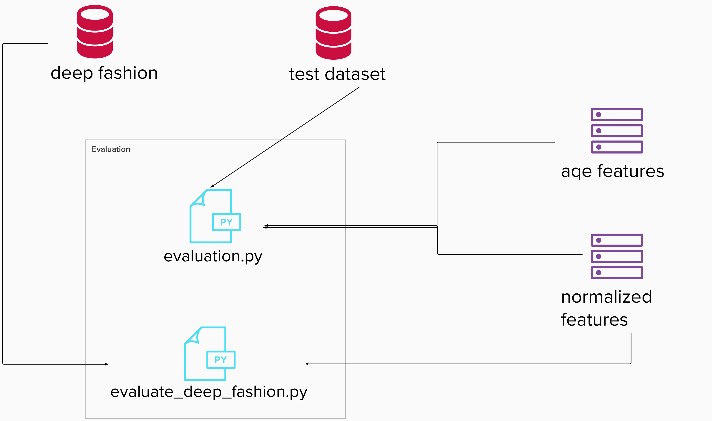
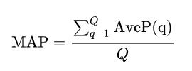
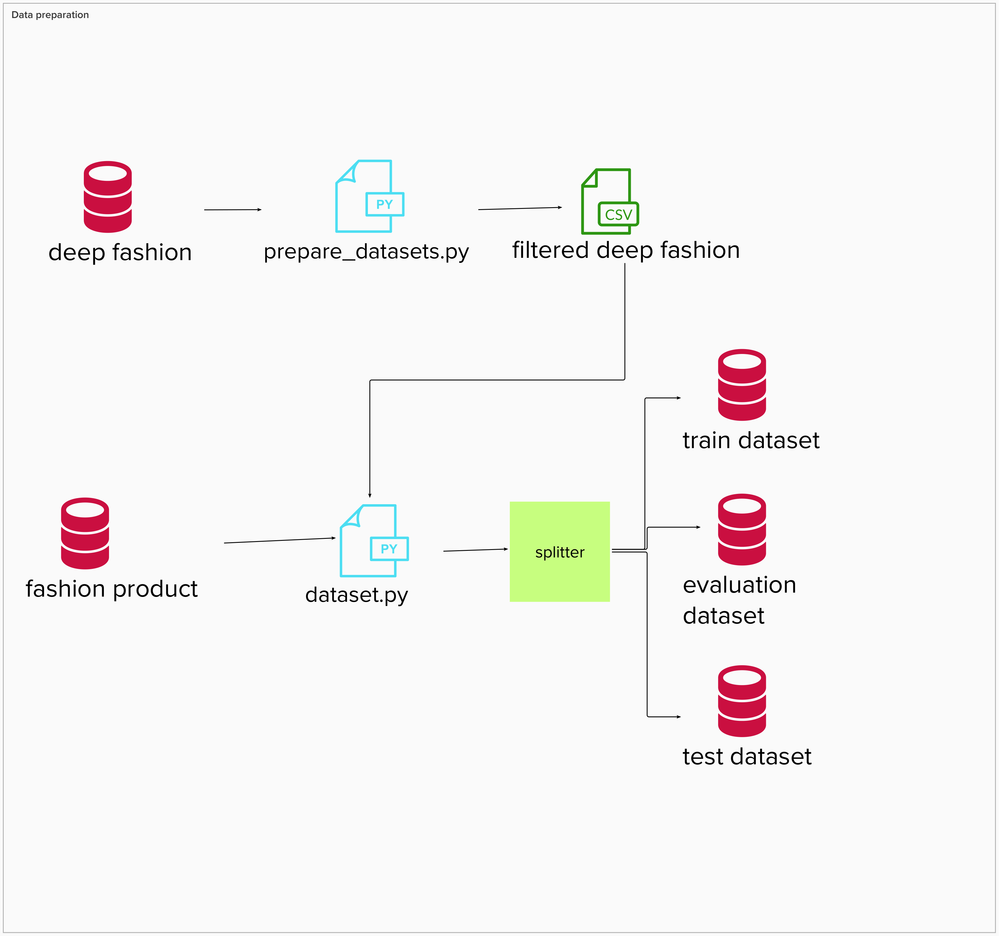

# Settings for VSCode

```
    {
    "version": "0.2.0",
    "configurations": [
        {
            "name": "Image Retrieval API Rest test",
            "type": "python",
            "request": "launch",
            "module": "flask",
            "env": {
                "FLASK_APP": "entrypoint.py",
                "FLASK_ENV": "development",
                "FLASK_DEBUG": "0",
                "DEVICE": "cpu",
                "DEBUG": "True",
                "DATASET_BASE_DIR": "${PROJECT_ROOT}/datasets/Fashion_Product_Full/fashion-dataset",
                "DATASET_LABELS_DIR": "${PROJECT_ROOT}/datasets/Fashion_Product_Full/fashion-dataset/styles.csv",
                "WORK_DIR": "${PROJECT_ROOT}/datasets/Fashion_Product_Full_Workdir",
                "LOG_DIR": "${PROJECT_ROOT}/datasets/Fashion_Product_Full_Workdir/log/"
            },
            "args": [
                "run",
                "--no-debugger",
                "--no-reload"
            ],
            "jinja": true
        },
        {
            "name": "Extract features",
            "type": "python",
            "request": "launch",
            "program": "${PROJECT_ROOT}/imageretrieval/src/features.py",
            "console": "integratedTerminal",
            "cwd": "${workspaceFolder}",
            "env": {
                "PYTHONPATH": "${cwd}",
                "DEVICE": "cuda",
                "DEBUG": "True",
                "DATASET_USEDNAME": "deepfashion", // deepfashion / fashionproduct
                "DATASET_BASE_DIR": "${PROJECT_ROOT}/datasets/Fashion_Product_Full/fashion-dataset",
                "DATASET_LABELS_DIR": "${PROJECT_ROOT}/datasets/Fashion_Product_Full/fashion-dataset/styles.csv",
                "WORK_DIR": "${PROJECT_ROOT}/datasets/Fashion_Product_Full_Subset_test",
                "LOG_DIR": "${PROJECT_ROOT}/datasets/Fashion_Product_Full_Subset_test/log/",
                "TRAIN_SIZE": "500",
                "TEST_VALIDATE_SIZE": "500"
            }
        },
        {
            "name": "Finetuning",
            "type": "python",
            "request": "launch",
            "program": "${PROJECT_ROOT}/imageretrieval/src/finetune.py",
            "console": "integratedTerminal",
            "cwd": "${workspaceFolder}",
            "env": {
                "PYTHONPATH": "${cwd}",
                "DEVICE": "cuda",
                "DEBUG": "True",
                "DATASET_USEDNAME": "deepfashion", // deepfashion / fashionproduct
                "DATASET_BASE_DIR": "${PROJECT_ROOT}/datasets/Fashion_Product_Full/fashion-dataset",
                "DATASET_LABELS_DIR": "${PROJECT_ROOT}/datasets/Fashion_Product_Full/fashion-dataset/styles.csv",
                "WORK_DIR": "${PROJECT_ROOT}/datasets/Fashion_Product_Full_Subset_test",
                "LOG_DIR": "${PROJECT_ROOT}/datasets/Fashion_Product_Full_Subset_test/log/",
                "TRAIN_SIZE": "all",
                "MAP_N_QUERIES" : "600",
                "TOP_K_IMAGE": "15",
                "PCA_ACCURACY_TYPE" : "pHits" // mAP / pHits
            }
        },
        {
            "name": "Engine test",
            "type": "python",
            "request": "launch",
            "program": "${PROJECT_ROOT}/imageretrieval/src/engine.py",
            "console": "integratedTerminal",
            "cwd": "${workspaceFolder}",
            "env": {
                "PYTHONPATH": "${cwd}",
                "DEVICE": "cpu",
                "DEBUG": "True",
                "DATASET_USEDNAME": "deepfashion", // deepfashion / fashionproduct
                "DATASET_BASE_DIR": "${PROJECT_ROOT}/datasets/Fashion_Product_Full/fashion-dataset",
                "DATASET_LABELS_DIR": "${PROJECT_ROOT}/datasets/Fashion_Product_Full/fashion-dataset/styles.csv",
                "WORK_DIR": "${PROJECT_ROOT}/datasets/Fashion_Product_Full_Subset_test",
                "LOG_DIR": "${PROJECT_ROOT}/datasets/Fashion_Product_Full_Subset_test/log/"
            }
        },
        {
            "name": "t-SNE graphs",
            "type": "python",
            "request": "launch",
            "program": "${PROJECT_ROOT}/imageretrieval/src/tSNE.py",
            "console": "integratedTerminal",
            "cwd": "${workspaceFolder}",
            "env": {
                "PYTHONPATH": "${cwd}",
                "DEVICE": "gpu",
                "DEBUG": "True",
                "DATASET_BASE_DIR": "${PROJECT_ROOT}/datasets/Fashion_Product_Full/fashion-dataset",
                "DATASET_LABELS_DIR": "${PROJECT_ROOT}/datasets/Fashion_Product_Full/fashion-dataset/styles.csv",
                "WORK_DIR": "${PROJECT_ROOT}/datasets/Fashion_Product_Full_Subset_test",
                "LOG_DIR": "${PROJECT_ROOT}/datasets/Fashion_Product_Full_Subset_test/log/"
            }
        }
    ]
}

```

# Command line execution

First define the PROJECT_ROOT variable.

```
export PROJECT_ROOT= {PATH TO PROJECT ROOT}
```

Then activate the environment.

```
source /home/fcandela/opt/miniconda3/bin/activate &&
conda activate image-retrieval-v1
```

# Command line execution for feature extraction

Activate the conda environment, setup environment vars and execute features.py.

```
export PYTHONPATH=${PROJECT_ROOT} &&
export DEVICE=cuda &&
export DEBUG=True &&
export DATASET_BASE_DIR=${PROJECT_ROOT}/datasets/Fashion_Product_Full/fashion-dataset &&
export DATASET_LABELS_DIR=${PROJECT_ROOT}/datasets/Fashion_Product_Full/fashion-dataset/styles.csv &&
export WORK_DIR=${PROJECT_ROOT}/datasets/Fashion_Product_Full_Workdir &&
export LOG_DIR=${PROJECT_ROOT}/datasets/Fashion_Product_Full_Workdir/log/ &&
export TRAIN_SIZE=all &&
export TEST_VALIDATE_SIZE=0 &&
python ${PROJECT_ROOT}/imageretrieval/src/features.py
```


# Command line execution for finetuning
Activate the conda environment, setup environment vars and execute finetune.py.

PCA_ACCURACY_TYPE: // mAP / pHits

```
export PYTHONPATH=${PROJECT_ROOT} &&
export DEVICE=cpu &&
export DEBUG=True &&
export DATASET_BASE_DIR=${PROJECT_ROOT}/datasets/Fashion_Product_Full/fashion-dataset &&
export DATASET_LABELS_DIR=${PROJECT_ROOT}/datasets/Fashion_Product_Full/fashion-dataset/styles.csv &&
export WORK_DIR=${PROJECT_ROOT}/datasets/Fashion_Product_Full_Workdir &&
export LOG_DIR=${PROJECT_ROOT}/datasets/Fashion_Product_Full_Workdir/log/ &&
export TRAIN_SIZE=all,
export MAP_N_QUERIES=600 &&
export PCA_ACCURACY_TYPE=pHits
python ${PROJECT_ROOT}/imageretrieval/src/finetune.py
```


# Command line execution for engine test
Activate the conda environment, setup environment vars and execute engine.py.

```
export PYTHONPATH=${PROJECT_ROOT} &&
export DEVICE=cpu &&
export DEBUG=True &&
export DATASET_BASE_DIR=${PROJECT_ROOT}/datasets/Fashion_Product_Full/fashion-dataset &&
export DATASET_LABELS_DIR=${PROJECT_ROOT}/datasets/Fashion_Product_Full/fashion-dataset/styles.csv &&
export WORK_DIR=${PROJECT_ROOT}/datasets/Fashion_Product_Full_Workdir &&
export LOG_DIR=${PROJECT_ROOT}/datasets/Fashion_Product_Full_Workdir/log/ &&
python ${PROJECT_ROOT}/imageretrieval/src/engine.py
```


# Command line execution for finetuning
Activate the conda environment, setup environment vars and execute tSNE.py.

```
export PYTHONPATH=${PROJECT_ROOT} &&
export DEVICE=gpu &&
export DEBUG=True &&
export DATASET_BASE_DIR=${PROJECT_ROOT}/datasets/Fashion_Product_Full/fashion-dataset &&
export DATASET_LABELS_DIR=${PROJECT_ROOT}/datasets/Fashion_Product_Full/fashion-dataset/styles.csv &&
export WORK_DIR=${PROJECT_ROOT}/datasets/Fashion_Product_Full_Workdir &&
export LOG_DIR=${PROJECT_ROOT}/datasets/Fashion_Product_Full_Workdir/log/ &&
python ${PROJECT_ROOT}/imageretrieval/src/tSNE.py
```
# Train (train.py)
Diagram of the train components


## What models do we use?
In all cases we use pre-trained models.

## Train Types
We use two different types of training:
1. We have named it "Transfer Learning". It is not exactly a training method. We use a trick to make batch norm statistics for the model to match our data set. The idea is to put the network into train mode and do a pass over the dataset without doing any backpropagation.
2. We have named it "scratch". The trained models have most of the layers frozen and we unfrozen only some, usually the last or others that we believe are adequate for our objective. In this case is a complete training method with all phases: train, evaluate and test.

## Train Datasets
We can use two datasets for train. We can use two datasets to train. The environment variable DATASET_USEDNAME defines which one to use: "fashionproduct" or "deepfashion"

## Train Results
The results are saved in two ways and in the folder of each model.

1. File: csv format log file

2. Graphics: loss plot and accuracy plot 

3. Model. Saved in each epoch if we consider that it has learned

## Train graphics example

>


## HIGHLIGHTS

* model_manager.get_model_names (models.py): Model list to train.
* model_manager.get_classifier (models.py): Load pre-trained model. Contains models definition, criterion, optimizer,...
* TRAIN_SIZE = "divide". Environment variable. Divide the dataset in train, eval and test ( 60% - 20% - 20%)
* ModelTrainConfig.get_num_epochs (config.py): Maximum number of epochs to train
* ModelTrainConfig.PATIENCE (config.py): Number of epochs to wait if no improvement and then stop the training.
* ModelTrainConfig.NUM_CLASSES (config.py): Number of output classes when training on "scratch" type
* All scratch models contains the suffix "_custom"


## Run train
1. If using visual studio.
    ```
    {  
        "version": "0.2.0",  
        "configurations": [  
        {          
            "name": "Train",  
            "type": "python",  
            "request": "launch",  
            "program": "${PROJECT_ROOT}/imageretrieval/src/train.py",  
            "console": "integratedTerminal",  
            "cwd": "${workspaceFolder}",  
            "env": {  
                "PYTHONPATH": "${cwd}",  
                "DEVICE": "cuda",  
                "DEBUG": "True",  
                "DATASET_BASE_DIR": "${PROJECT_ROOT}/datasets/Fashion_Product_Full/fashion-dataset",  
                "DATASET_LABELS_DIR": "${PROJECT_ROOT}/datasets/Fashion_Product_Full/fashion-dataset/styles.csv",  
                "WORK_DIR": "${PROJECT_ROOT}/datasets/Fashion_Product_Full_Subset_test",  
                "LOG_DIR": "${PROJECT_ROOT}/datasets/Fashion_Product_Full_Subset_test/log/  
                "TRAIN_SIZE": "divide",  
                "TEST_VALIDATE_SIZE": "0",  
                "TRAIN_TYPE" : "scratch"  
            }  
        }  
    }
    ```

2. If using terminal:
    * Activate the conda environment, setup environment vars and execute evaluation.py.

        ```
        export PYTHONPATH=${PROJECT_ROOT} &&
        export DEVICE=cuda &&
        export DEBUG=True &&
        export DATASET_BASE_DIR=${PROJECT_ROOT}/datasets/Fashion_Product_Full/fashion-dataset &&
        export DATASET_LABELS_DIR=${PROJECT_ROOT}/datasets/Fashion_Product_Full/fashion-dataset/styles.csv &&
        export WORK_DIR=${PROJECT_ROOT}/datasets/Fashion_Product_Full_Workdir &&
        export LOG_DIR=${PROJECT_ROOT}/datasets/Fashion_Product_Full_Workdir/log/ &&
        export TRAIN_SIZE=divide &&
        export TRAIN_TYPE=scratch &&
        export TEST_VALIDATE_SIZE=0 &&
        python ${PROJECT_ROOT}/imageretrieval/src/train.py
        ```

# PCA Finetune (finetune.py)

For features extracted from the models, we perform a post-processing that consists of a normalization and a reduction of the dimensionality. To reduce dimensionality we use the PCA technique (Principal Component Analysis)


*[1] Jégou, H., & Chum, O. (2012).
Negative evidences and co occurrences in image retrieval: the benefit of PCA and whitening Lecture Notes in Computer Science, 7573 LNCS (PART 2), 774 787*

PCA finetune is the process that will find the best value for n_components in PCA (n_components)  through two metrics: 
1. mAP (mean Average Precision)
2. precision Hits (average of the number of correct classes in the ranking returned by each query)

The process uses the raw features generated by the model and looks for the best PCA dimensionality. The process consists of dividing the initial dimensionality of the features (generated by the model) into intervals of initial_dimensionality/**interval**,  where interval in our case receives the value 10. 

The first approach was a list values of PCA that we need to calculate the two metrics mentioned before. The best PCA values is used to generate the new interval of possible values of PCA Dimensions. The new evaluation interval will be each time more closed, until the best dimension is found.

# Evaluation

Diagram of the evaluation components that shows data flow when running evaluation for fashion product and deep fashion:   
       
    Evaluation diagram
In order to calculate the evaluation for product fashion we have used the subset of data that we have called test dataset as it is explained in the training section. Then we have used normalized featured for one of the results and in order to compare we also have calculated the evaluation with the average query expansion features.

In order to evaluate our retrieval engine we have decide to focus the attention on precision and recall.   
      
    Precision and recall provided by Wikipedia
* For precision we have used the mAP algorithm, since it is the most common way to evaluate retrieval systems  
      
    Mean average precision formula given provided by Wikipedia  

* For recall we have use precision hits of the top 15 clothing images.

On the other hand we have also used speed of the executions to measure our system and compare different models.

We have run the evaluation on each of the models that we have trained. Moreover we have run the evaluation on two different datasets, `fashion product` and `deep fashion`.

Here an example of the values obtained for the different evaluation systems:

| ModelName   |   DataSetSize   |  UsedFeatures |   FeaturesSize |  ProcessTime  |  mAP  |  PrecisionHits  |
|-------------|:---------------:|--------------:|----------------|:-------------:|------:|----------------:|
| vgg16 |  390 | NormalizedFeatures |  128 | 0:10:22.166937 |  0.090003 |  0.160686 |
| resnet50 |    390   |   NormalizedFeatures |  128 | 0:09:35.969118 |  0.060651 |  0.111287 |
| inception_v3 | 390 |    NormalizedFeatures |  128 | 0:09:13.525337 |  0.062526 |  0.126841 |
| densenet161 | 390 |    NormalizedFeatures |  128 | 0:11:24.438227 |  0.066571 |  0.155388 |
| resnet50_custom | 390 |    NormalizedFeatures |  128 | 0:09:33.012131 |  0.057209 |  0.114533 |
| vgg16_custom | 390 |    NormalizedFeatures |  128 | 0:10:07.504492 |  0.097952 |  0.178293 |
| densenet161_custom | 390 |    NormalizedFeatures |  128 | 0:10:37.180019 |  0.102703 |  0.215557 |
  
  
### How to run evaluations
1. If using visual studio 
    * Include this two configurations
    ```
        {
        "version": "0.2.0",
        "configurations": [
            {
                "name": "Evaluation",
                "type": "python",
                "request": "launch",
                "program": "${PROJECT_ROOT}/imageretrieval/src/evaluation.py",
                "console": "integratedTerminal",
                "cwd": "${workspaceFolder}",
                "env": {
                    "PYTHONPATH": "${cwd}",
                    "DEVICE": "cuda",
                    "DEBUG": "True",
                    "DATASET_USEDNAME": "deepfashion", // deepfashion / fashionproduct
                    "DATASET_BASE_DIR": "${PROJECT_ROOT}/datasets/Fashion_Product_Full/fashion-dataset",
                    "DATASET_LABELS_DIR": "${PROJECT_ROOT}/datasets/Fashion_Product_Full/fashion-dataset/styles.csv",
                    "WORK_DIR": "${PROJECT_ROOT}/datasets/Fashion_Product_Full_Subset_test",
                    "LOG_DIR": "${PROJECT_ROOT}/datasets/Fashion_Product_Full_Subset_test/log/",
                    "TRAIN_SIZE": "500",
                    "TEST_VALIDATE_SIZE": "500",
                    "GT_SELECTION_MODE": "Random",
                    "MAP_N_QUERIES": "300",
                    "TOP_K_IMAGE": "15"
                }
            },
            {
                "name": "Evaluate deep fashion",
                "type": "python",
                "request": "launch",
                "program": "${PROJECT_ROOT}/imageretrieval/src/evaluate_deep_fashion.py",
                "console": "integratedTerminal",
                "cwd": "${workspaceFolder}",
                "env": {
                    "PYTHONPATH": "${cwd}",
                    "DEBUG": "True",
                    "DATASET_BASE_DIR": "${PROJECT_ROOT}/datasets/DeepFashion",
                "DATASET_LABELS_DIR": "${PROJECT_ROOT}/imageretrieval/resources/deep_fashion/deep_fashion_with_article_type.csv",
                "WORK_DIR": "${PROJECT_ROOT}/datasets/Fashion_Product_Full_Workdir",
                "LOG_DIR": "${PROJECT_ROOT}/datasets/Fashion_Product_Full_Workdir/log/",
                "TOP_K_IMAGE": "15",
                    "QUERIES_PER_LABEL": "100"
                }
            }
        ]
    }

    ```
2. If using terminal:
    * Activate the conda environment, setup environment vars and execute evaluation.py.

        ```
        export PYTHONPATH=${PROJECT_ROOT} &&
        export DEVICE=cuda &&
        export DEBUG=True &&
        export DATASET_BASE_DIR=${PROJECT_ROOT}/datasets/Fashion_Product_Full/fashion-dataset &&
        export DATASET_LABELS_DIR=${PROJECT_ROOT}/datasets/Fashion_Product_Full/fashion-dataset/styles.csv &&
        export WORK_DIR=${PROJECT_ROOT}/datasets/Fashion_Product_Full_Workdir &&
        export LOG_DIR=${PROJECT_ROOT}/datasets/Fashion_Product_Full_Workdir/log/ &&
        export TRAIN_SIZE=divide &&
        export TEST_VALIDATE_SIZE=0 &&
        export GT_SELECTION_MODE=Random &&
        export MAP_N_QUERIES=600 &&
        export TOP_K_IMAGE=15 &&
        python ${PROJECT_ROOT}/imageretrieval/src/evaluation.py
        ```

        ```
        export PYTHONPATH=${PROJECT_ROOT} &&
        export DEVICE=cpu &&
        export DEBUG=True &&
        export DATASET_BASE_DIR=${PROJECT_ROOT}/datasets/DeepFashion &&
        export DATASET_LABELS_DIR=${PROJECT_ROOT}/imageretrieval/resources/deep_fashion/deep_fashion_with_article_type.csv &&
        export WORK_DIR=${PROJECT_ROOT}/datasets/Fashion_Product_Full_Workdir &&
        export LOG_DIR=${PROJECT_ROOT}/datasets/Fashion_Product_Full_Workdir/log/ &&
        export TOP_K_IMAGE=15 &&
        export QUERIES_PER_LABEL=100 &&
        python ${PROJECT_ROOT}/imageretrieval/src/evaluate_deep_fashion.py
        ```
# Data preparation

Diagram to show the data flow of the prepare data functions  
      
    Data preparation diagram


This functions as the name is indicating perform different operations necessary to be able to work with the different dataset structures.  
We started working with a dataset called fashion product which contains a `.csv` with the description of each image and the characteristics. You can take a look at a sample of the content of the mentioned `.csv` [here](../docs/files/sample_fashion_product.csv)
When using deep fashion dataset we needed to adapt the way images are stored and also using the same characteristics as in fashion product. We created a mapping `.csv` to adapt the article type of the clothes. You can take a look [here](docs/files/sample_fashion_product.csv) to this mapping file.  

The main operations that we have included are:  
* Splitter to divide the images into train, validate and test. In this way we use different images for each of this steps of our retrieval system.
* Create a `.csv` for deep fashion with the same characteristics that we use for product fashion. Example:  

| id   |   path   |  categoryName |   articleType |  dataset  |
|------|:--------:|--------------:|---------------|:---------:|
|100000|img/Sheer_Pleated-Front_Blouse/img_00000001.jpg|Blouse|Shirts|deep_fashion|
|100001|img/Sheer_Pleated-Front_Blouse/img_00000002.jpg|Blouse|Shirts|deep_fashion|
|184526|img/Dreaming_And_Scheming_Hoodie/img_00000026.jpg|Hoodie|Sweaters|deep_fashion|
|184527|img/Dreaming_And_Scheming_Hoodie/img_00000027.jpg|Hoodie|Sweaters|deep_fashion|
|184528|img/Drop-Sleeve_Heathered_Tee/img_00000001.jpg|Tee|Tshirts|deep_fashion|
|184529|img/Drop-Sleeve_Heathered_Tee/img_00000002.jpg|Tee|Tshirts|deep_fashion|
|243124|img/Marled_Terrycloth_Joggers/img_00000033.jpg|Joggers|Lounge Pants|deep_fashion|
|243125|img/Marled_Terrycloth_Joggers/img_00000034.jpg|Joggers|Lounge Pants|deep_fashion|
|243126|img/Marled_Terrycloth_PJ_Sweatpants/img_00000026.jpg|Sweatpants|Lounge Pants|deep_fashion|
|243127|img/Marled_Terrycloth_PJ_Sweatpants/img_00000027.jpg|Sweatpants|Lounge Pants|deep_fashion|

### How to run prepare datasets
1. If using visual studio 
    * Include this two configurations 
    ```
        {
        "version": "0.2.0",
        "configurations": [
            {
                "name": "Prepare datasets",
                "type": "python",
                "request": "launch",
                "program": "${PROJECT_ROOT}/imageretrieval/src/prepare_datasets.py",
                "console": "integratedTerminal",
                "cwd": "${workspaceFolder}",
                "env": {
                    "PYTHONPATH": "${cwd}",
                    "DEVICE": "cuda",
                    "DEBUG": "True",
                    "DATASET_BASE_DIR": "${PROJECT_ROOT}/datasets/Fashion_Product_Full/fashion-dataset",
                    "DATASET_LABELS_DIR": "${PROJECT_ROOT}/datasets/Fashion_Product_Full/fashion-dataset/styles.csv",
                    "WORK_DIR": "${PROJECT_ROOT}/datasets/Fashion_Product_Full_Subset_test",
                    "LOG_DIR": "${PROJECT_ROOT}/datasets/Fashion_Product_Full_Subset_test/log/",
                    "RESOURCES_DIR": "${PROJECT_ROOT}/imageretrieval/resources/",
                }
            }
        ]
        }

    ```

2. If using terminal:
    * Activate the conda environment, setup environment vars and execute evaluation.py.

        ```
        export PYTHONPATH=${PROJECT_ROOT} &&
        export DEVICE=cuda &&
        export DEBUG=True &&
        export DATASET_BASE_DIR=${PROJECT_ROOT}/datasets/Fashion_Product_Full/fashion-dataset &&
        export DATASET_LABELS_DIR=${PROJECT_ROOT}/datasets/Fashion_Product_Full/fashion-dataset/styles.csv &&
        export WORK_DIR=${PROJECT_ROOT}/datasets/Fashion_Product_Full_Workdir &&
        export LOG_DIR=${PROJECT_ROOT}/datasets/Fashion_Product_Full_Workdir/log/ &&
        export RESOURCES_DIR=${PROJECT_ROOT}/imageretrieval/resources/ &&
        python ${PROJECT_ROOT}/imageretrieval/src/prepare_datasets.py
        ```