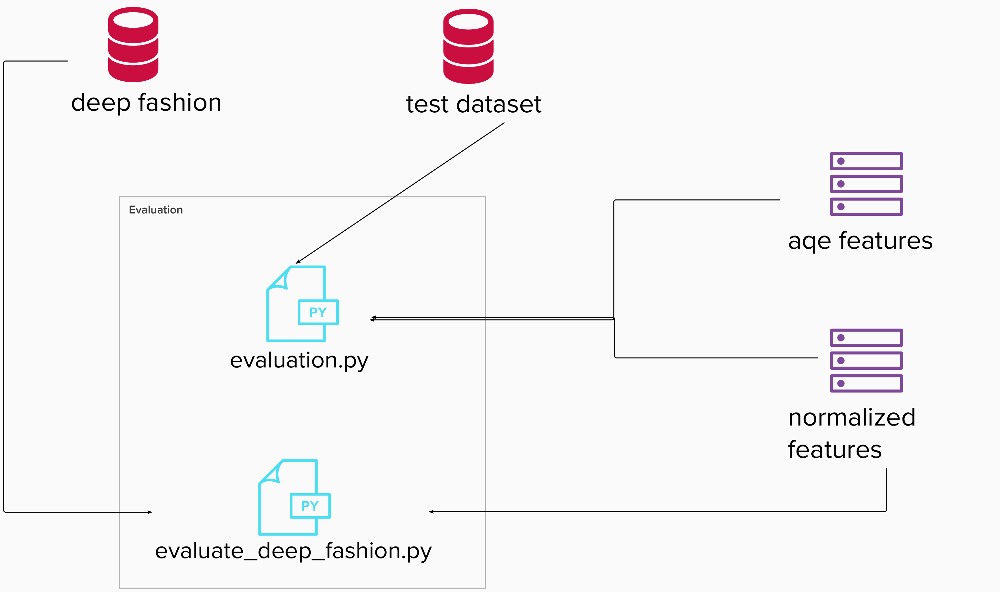

# Settings for VSCode

```
    {
    "version": "0.2.0",
    "configurations": [
        {
            "name": "Image Retrieval API Rest test",
            "type": "python",
            "request": "launch",
            "module": "flask",
            "env": {
                "FLASK_APP": "entrypoint.py",
                "FLASK_ENV": "development",
                "FLASK_DEBUG": "0",
                "DEVICE": "cpu",
                "DEBUG": "True",
                "DATASET_BASE_DIR": "${PROJECT_ROOT}/datasets/Fashion_Product_Full/fashion-dataset",
                "DATASET_LABELS_DIR": "${PROJECT_ROOT}/datasets/Fashion_Product_Full/fashion-dataset/styles.csv",
                "WORK_DIR": "${PROJECT_ROOT}/datasets/Fashion_Product_Full_Workdir",
                "LOG_DIR": "${PROJECT_ROOT}/datasets/Fashion_Product_Full_Workdir/log/"
            },
            "args": [
                "run",
                "--no-debugger",
                "--no-reload"
            ],
            "jinja": true
        },
        {
            "name": "Train",
            "type": "python",
            "request": "launch",
            "program": "${PROJECT_ROOT}/imageretrieval/src/train.py",
            "console": "integratedTerminal",
            "cwd": "${workspaceFolder}",
            "env": {
                "PYTHONPATH": "${cwd}",
                "DEVICE": "cuda",
                "DEBUG": "True",
                "DATASET_USEDNAME": "deepfashion", // deepfashion / fashionproduct
                "DATASET_BASE_DIR": "${PROJECT_ROOT}/datasets/Fashion_Product_Full/fashion-dataset",
                "DATASET_LABELS_DIR": "${PROJECT_ROOT}/datasets/Fashion_Product_Full/fashion-dataset/styles.csv",
                "WORK_DIR": "${PROJECT_ROOT}/datasets/Fashion_Product_Full_Subset_test",
                "LOG_DIR": "${PROJECT_ROOT}/datasets/Fashion_Product_Full_Subset_test/log/",
                "TRAIN_SIZE": "500",
                "TEST_VALIDATE_SIZE": "500"
            }
        },
        {
            "name": "Extract features",
            "type": "python",
            "request": "launch",
            "program": "${PROJECT_ROOT}/imageretrieval/src/features.py",
            "console": "integratedTerminal",
            "cwd": "${workspaceFolder}",
            "env": {
                "PYTHONPATH": "${cwd}",
                "DEVICE": "cuda",
                "DEBUG": "True",
                "DATASET_USEDNAME": "deepfashion", // deepfashion / fashionproduct
                "DATASET_BASE_DIR": "${PROJECT_ROOT}/datasets/Fashion_Product_Full/fashion-dataset",
                "DATASET_LABELS_DIR": "${PROJECT_ROOT}/datasets/Fashion_Product_Full/fashion-dataset/styles.csv",
                "WORK_DIR": "${PROJECT_ROOT}/datasets/Fashion_Product_Full_Subset_test",
                "LOG_DIR": "${PROJECT_ROOT}/datasets/Fashion_Product_Full_Subset_test/log/",
                "TRAIN_SIZE": "500",
                "TEST_VALIDATE_SIZE": "500"
            }
        },
        {
            "name": "Finetuning",
            "type": "python",
            "request": "launch",
            "program": "${PROJECT_ROOT}/imageretrieval/src/finetune.py",
            "console": "integratedTerminal",
            "cwd": "${workspaceFolder}",
            "env": {
                "PYTHONPATH": "${cwd}",
                "DEVICE": "cuda",
                "DEBUG": "True",
                "DATASET_USEDNAME": "deepfashion", // deepfashion / fashionproduct
                "DATASET_BASE_DIR": "${PROJECT_ROOT}/datasets/Fashion_Product_Full/fashion-dataset",
                "DATASET_LABELS_DIR": "${PROJECT_ROOT}/datasets/Fashion_Product_Full/fashion-dataset/styles.csv",
                "WORK_DIR": "${PROJECT_ROOT}/datasets/Fashion_Product_Full_Subset_test",
                "LOG_DIR": "${PROJECT_ROOT}/datasets/Fashion_Product_Full_Subset_test/log/",
                "TRAIN_SIZE": "all",
                "MAP_N_QUERIES" : "600",
                "TOP_K_IMAGE": "15",
                "PCA_ACCURACY_TYPE" : "pHits" // mAP / pHits
            }
        },
        {
            "name": "Engine test",
            "type": "python",
            "request": "launch",
            "program": "${PROJECT_ROOT}/imageretrieval/src/engine.py",
            "console": "integratedTerminal",
            "cwd": "${workspaceFolder}",
            "env": {
                "PYTHONPATH": "${cwd}",
                "DEVICE": "cpu",
                "DEBUG": "True",
                "DATASET_USEDNAME": "deepfashion", // deepfashion / fashionproduct
                "DATASET_BASE_DIR": "${PROJECT_ROOT}/datasets/Fashion_Product_Full/fashion-dataset",
                "DATASET_LABELS_DIR": "${PROJECT_ROOT}/datasets/Fashion_Product_Full/fashion-dataset/styles.csv",
                "WORK_DIR": "${PROJECT_ROOT}/datasets/Fashion_Product_Full_Subset_test",
                "LOG_DIR": "${PROJECT_ROOT}/datasets/Fashion_Product_Full_Subset_test/log/"
            }
        },
        {
            "name": "Prepare datasets",
            "type": "python",
            "request": "launch",
            "program": "${PROJECT_ROOT}/imageretrieval/src/prepare_datasets.py",
            "console": "integratedTerminal",
            "cwd": "${workspaceFolder}",
            "env": {
                "PYTHONPATH": "${cwd}",
                "DEVICE": "cuda",
                "DEBUG": "True",
                "DATASET_BASE_DIR": "${PROJECT_ROOT}/datasets/Fashion_Product_Full/fashion-dataset",
                "DATASET_LABELS_DIR": "${PROJECT_ROOT}/datasets/Fashion_Product_Full/fashion-dataset/styles.csv",
                "WORK_DIR": "${PROJECT_ROOT}/datasets/Fashion_Product_Full_Subset_test",
                "LOG_DIR": "${PROJECT_ROOT}/datasets/Fashion_Product_Full_Subset_test/log/",
                "RESOURCES_DIR": "${PROJECT_ROOT}/imageretrieval/resources/",
            }
        },
        {
            "name": "t-SNE graphs",
            "type": "python",
            "request": "launch",
            "program": "${PROJECT_ROOT}/imageretrieval/src/tSNE.py",
            "console": "integratedTerminal",
            "cwd": "${workspaceFolder}",
            "env": {
                "PYTHONPATH": "${cwd}",
                "DEVICE": "gpu",
                "DEBUG": "True",
                "DATASET_BASE_DIR": "${PROJECT_ROOT}/datasets/Fashion_Product_Full/fashion-dataset",
                "DATASET_LABELS_DIR": "${PROJECT_ROOT}/datasets/Fashion_Product_Full/fashion-dataset/styles.csv",
                "WORK_DIR": "${PROJECT_ROOT}/datasets/Fashion_Product_Full_Subset_test",
                "LOG_DIR": "${PROJECT_ROOT}/datasets/Fashion_Product_Full_Subset_test/log/"
            }
        }
    ]
}

```

# Command line execution

First define the PROJECT_ROOT variable.

```
export PROJECT_ROOT= {PATH TO PROJECT ROOT}
```

Then activate the environment.

```
source /home/fcandela/opt/miniconda3/bin/activate &&
conda activate image-retrieval-v1
```

## Command line execution for training

Activate the conda environment, setup environment vars and execute train.py.

```
export PYTHONPATH=${PROJECT_ROOT} &&
export DEVICE=cuda &&
export DEBUG=True &&
export DATASET_BASE_DIR=${PROJECT_ROOT}/datasets/Fashion_Product_Full/fashion-dataset &&
export DATASET_LABELS_DIR=${PROJECT_ROOT}/datasets/Fashion_Product_Full/fashion-dataset/styles.csv &&
export WORK_DIR=${PROJECT_ROOT}/datasets/Fashion_Product_Full_Workdir &&
export LOG_DIR=${PROJECT_ROOT}/datasets/Fashion_Product_Full_Workdir/log/ &&
export TRAIN_SIZE=divide &&
export TEST_VALIDATE_SIZE=0 &&
python ${PROJECT_ROOT}/imageretrieval/src/train.py
```

# Command line execution for feature extraction

Activate the conda environment, setup environment vars and execute features.py.

```
export PYTHONPATH=${PROJECT_ROOT} &&
export DEVICE=cuda &&
export DEBUG=True &&
export DATASET_BASE_DIR=${PROJECT_ROOT}/datasets/Fashion_Product_Full/fashion-dataset &&
export DATASET_LABELS_DIR=${PROJECT_ROOT}/datasets/Fashion_Product_Full/fashion-dataset/styles.csv &&
export WORK_DIR=${PROJECT_ROOT}/datasets/Fashion_Product_Full_Workdir &&
export LOG_DIR=${PROJECT_ROOT}/datasets/Fashion_Product_Full_Workdir/log/ &&
export TRAIN_SIZE=all &&
export TEST_VALIDATE_SIZE=0 &&
python ${PROJECT_ROOT}/imageretrieval/src/features.py
```


# Command line execution for finetuning
Activate the conda environment, setup environment vars and execute finetune.py.

PCA_ACCURACY_TYPE: // mAP / pHits

```
export PYTHONPATH=${PROJECT_ROOT} &&
export DEVICE=cpu &&
export DEBUG=True &&
export DATASET_BASE_DIR=${PROJECT_ROOT}/datasets/Fashion_Product_Full/fashion-dataset &&
export DATASET_LABELS_DIR=${PROJECT_ROOT}/datasets/Fashion_Product_Full/fashion-dataset/styles.csv &&
export WORK_DIR=${PROJECT_ROOT}/datasets/Fashion_Product_Full_Workdir &&
export LOG_DIR=${PROJECT_ROOT}/datasets/Fashion_Product_Full_Workdir/log/ &&
export TRAIN_SIZE=all,
export MAP_N_QUERIES=600 &&
export PCA_ACCURACY_TYPE=pHits
python ${PROJECT_ROOT}/imageretrieval/src/finetune.py
```


# Command line execution for engine test
Activate the conda environment, setup environment vars and execute engine.py.

```
export PYTHONPATH=${PROJECT_ROOT} &&
export DEVICE=cpu &&
export DEBUG=True &&
export DATASET_BASE_DIR=${PROJECT_ROOT}/datasets/Fashion_Product_Full/fashion-dataset &&
export DATASET_LABELS_DIR=${PROJECT_ROOT}/datasets/Fashion_Product_Full/fashion-dataset/styles.csv &&
export WORK_DIR=${PROJECT_ROOT}/datasets/Fashion_Product_Full_Workdir &&
export LOG_DIR=${PROJECT_ROOT}/datasets/Fashion_Product_Full_Workdir/log/ &&
python ${PROJECT_ROOT}/imageretrieval/src/engine.py
```


# Command line execution for finetuning
Activate the conda environment, setup environment vars and execute tSNE.py.

```
export PYTHONPATH=${PROJECT_ROOT} &&
export DEVICE=gpu &&
export DEBUG=True &&
export DATASET_BASE_DIR=${PROJECT_ROOT}/datasets/Fashion_Product_Full/fashion-dataset &&
export DATASET_LABELS_DIR=${PROJECT_ROOT}/datasets/Fashion_Product_Full/fashion-dataset/styles.csv &&
export WORK_DIR=${PROJECT_ROOT}/datasets/Fashion_Product_Full_Workdir &&
export LOG_DIR=${PROJECT_ROOT}/datasets/Fashion_Product_Full_Workdir/log/ &&
python ${PROJECT_ROOT}/imageretrieval/src/tSNE.py
```


# Evaluation

Diagram of the evaluation components


In order to evaluate our retrieval engine we have decide to focus the attention on precision and recall. 
* For precision we hace used the mAP since it is the most common way to evaluate retreival systems
* For recall we have use precision hits of the top 15 results.

On the other hand we have also used speed of the executions tu measure our system and compare different models.

We have build evaluation for the different models that we use to train, but also for two different data sets, `fashion product` and `deep fashion`.

Here an example of the values:

| ModelName   |   DataSetSize   |  UsedFeatures |   FeaturesSize |  ProcessTime  |  mAP  |  PrecisionHits  |
|-------------|:---------------:|--------------:|----------------|:-------------:|------:|-----------------:|
| vgg16 |  390 | NormalizedFeatures |  128 | 0:10:22.166937 |  0.090003 |  0.0489 |
| resnet50 |    390   |   NormalizedFeatures |  128 | 0:09:35.969118 |  0.060651 |  0.0489 |
| inception_v3 | 390 |    NormalizedFeatures |  128 | 0:09:13.525337 |  0.062526 |  0.0489 |
| densenet161 | 390 |    NormalizedFeatures |  128 | 0:11:24.438227 |  0.066571 |  0.0489 |
| resnet50_custom | 390 |    NormalizedFeatures |  128 | 0:09:33.012131 |  0.057209 |  0.0489 |
| vgg16_custom | 390 |    NormalizedFeatures |  128 | 0:10:07.504492 |  0.097952 |  0.0489 |
| densenet161_custom | 390 |    NormalizedFeatures |  128 | 0:10:37.180019 |  0.102703 |  0.0489 |


## Run evaluations
1. If using visual studio 
    * Include this two configurations
    ```
        {
        "version": "0.2.0",
        "configurations": [
            {
                "name": "Evaluation",
                "type": "python",
                "request": "launch",
                "program": "${PROJECT_ROOT}/imageretrieval/src/evaluation.py",
                "console": "integratedTerminal",
                "cwd": "${workspaceFolder}",
                "env": {
                    "PYTHONPATH": "${cwd}",
                    "DEVICE": "cuda",
                    "DEBUG": "True",
                    "DATASET_USEDNAME": "deepfashion", // deepfashion / fashionproduct
                    "DATASET_BASE_DIR": "${PROJECT_ROOT}/datasets/Fashion_Product_Full/fashion-dataset",
                    "DATASET_LABELS_DIR": "${PROJECT_ROOT}/datasets/Fashion_Product_Full/fashion-dataset/styles.csv",
                    "WORK_DIR": "${PROJECT_ROOT}/datasets/Fashion_Product_Full_Subset_test",
                    "LOG_DIR": "${PROJECT_ROOT}/datasets/Fashion_Product_Full_Subset_test/log/",
                    "TRAIN_SIZE": "500",
                    "TEST_VALIDATE_SIZE": "500",
                    "GT_SELECTION_MODE": "Random",
                    "MAP_N_QUERIES": "300",
                    "TOP_K_IMAGE": "15"
                }
            },
            {
                "name": "Evaluate deep fashion",
                "type": "python",
                "request": "launch",
                "program": "${PROJECT_ROOT}/imageretrieval/src/evaluate_deep_fashion.py",
                "console": "integratedTerminal",
                "env": {
                    "DEBUG": "True",
                    "DATASET_BASE_DIR": "${PROJECT_ROOT}/Project/Fashion_Product_Full/",
                    "WORK_DIR": "${PROJECT_ROOT}/Project/Fashion_Product_Full/processed_datalab/",
                    "LOG_DIR": "${PROJECT_ROOT}/Project/Fashion_Product_Full/processed_datalab/log/"
                }
            }
        ]
    }

    ```
2. If using terminal:
    * Activate the conda environment, setup environment vars and execute evaluation.py.

        ```
        export PYTHONPATH=${PROJECT_ROOT} &&
        export DEVICE=cuda &&
        export DEBUG=True &&
        export DATASET_BASE_DIR=${PROJECT_ROOT}/datasets/Fashion_Product_Full/fashion-dataset &&
        export DATASET_LABELS_DIR=${PROJECT_ROOT}/datasets/Fashion_Product_Full/fashion-dataset/styles.csv &&
        export WORK_DIR=${PROJECT_ROOT}/datasets/Fashion_Product_Full_Workdir &&
        export LOG_DIR=${PROJECT_ROOT}/datasets/Fashion_Product_Full_Workdir/log/ &&
        export TRAIN_SIZE=divide &&
        export TEST_VALIDATE_SIZE=0 &&
        export GT_SELECTION_MODE=Random &&
        export MAP_N_QUERIES=600 &&
        export TOP_K_IMAGE=15 &&
        python ${PROJECT_ROOT}/imageretrieval/src/evaluation.py
        ```