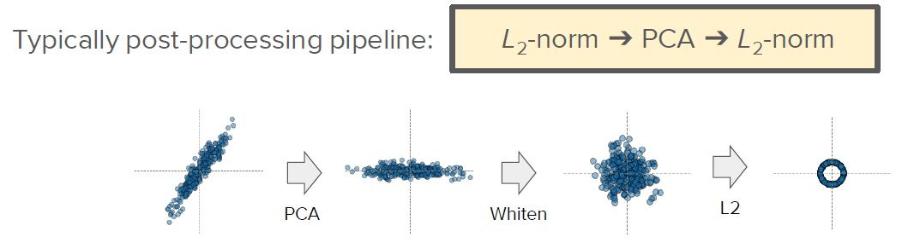

# Image retrieval - similarity engine
Documentation of the different parts of image retrieval engine:
* [Data preparation](#datapreparation)
* [Training](#training)
* [Model](#model)
* [Feature extraction](#featureextraction)
* [Finetune](#finetune)
* [Evaluation](#evaluation)
* [Feature visualization](#featurevisualization)

# Settings for VSCode

```
    {
    "version": "0.2.0",
    "configurations": [
        {
            "name": "Train",
            "type": "python",
            "request": "launch",
            "program": "${PROJECT_ROOT}/imageretrieval/src/train.py",
            "console": "integratedTerminal",
            "cwd": "${workspaceFolder}",
            "env": {
                "PYTHONPATH": "${cwd}",
                "DEVICE": "cuda",
                "DEBUG": "True",
                "DATASET_USEDNAME": "deepfashion", // deepfashion / fashionproduct
                "DATASET_BASE_DIR": "${PROJECT_ROOT}/datasets/Fashion_Product_Full/fashion-dataset",
                "DATASET_LABELS_DIR": "${PROJECT_ROOT}/datasets/Fashion_Product_Full/fashion-dataset/styles.csv",
                "WORK_DIR": "${PROJECT_ROOT}/datasets/Fashion_Product_Full_Subset_test",
                "LOG_DIR": "${PROJECT_ROOT}/datasets/Fashion_Product_Full_Subset_test/log/",
                "TRAIN_SIZE": "500",
                "TEST_VALIDATE_SIZE": "500"
            }
        },
        {
            "name": "Extract features",
            "type": "python",
            "request": "launch",
            "program": "${PROJECT_ROOT}/imageretrieval/src/features.py",
            "console": "integratedTerminal",
            "cwd": "${workspaceFolder}",
            "env": {
                "PYTHONPATH": "${cwd}",
                "DEVICE": "cuda",
                "DEBUG": "True",
                "DATASET_USEDNAME": "deepfashion", // deepfashion / fashionproduct
                "DATASET_BASE_DIR": "${PROJECT_ROOT}/datasets/Fashion_Product_Full/fashion-dataset",
                "DATASET_LABELS_DIR": "${PROJECT_ROOT}/datasets/Fashion_Product_Full/fashion-dataset/styles.csv",
                "WORK_DIR": "${PROJECT_ROOT}/datasets/Fashion_Product_Full_Subset_test",
                "LOG_DIR": "${PROJECT_ROOT}/datasets/Fashion_Product_Full_Subset_test/log/",
                "TRAIN_SIZE": "500",
                "TEST_VALIDATE_SIZE": "500"
            }
        },
        {
            "name": "Finetuning",
            "type": "python",
            "request": "launch",
            "program": "${PROJECT_ROOT}/imageretrieval/src/finetune.py",
            "console": "integratedTerminal",
            "cwd": "${workspaceFolder}",
            "env": {
                "PYTHONPATH": "${cwd}",
                "DEVICE": "cuda",
                "DEBUG": "True",
                "DATASET_USEDNAME": "deepfashion", // deepfashion / fashionproduct
                "DATASET_BASE_DIR": "${PROJECT_ROOT}/datasets/Fashion_Product_Full/fashion-dataset",
                "DATASET_LABELS_DIR": "${PROJECT_ROOT}/datasets/Fashion_Product_Full/fashion-dataset/styles.csv",
                "WORK_DIR": "${PROJECT_ROOT}/datasets/Fashion_Product_Full_Subset_test",
                "LOG_DIR": "${PROJECT_ROOT}/datasets/Fashion_Product_Full_Subset_test/log/",
                "TRAIN_SIZE": "all",
                "MAP_N_QUERIES" : "600",
                "TOP_K_IMAGE": "15",
                "PCA_ACCURACY_TYPE" : "pHits" // mAP / pHits
            }
        },
        {
            "name": "Engine test",
            "type": "python",
            "request": "launch",
            "program": "${PROJECT_ROOT}/imageretrieval/src/engine.py",
            "console": "integratedTerminal",
            "cwd": "${workspaceFolder}",
            "env": {
                "PYTHONPATH": "${cwd}",
                "DEVICE": "cpu",
                "DEBUG": "True",
                "DATASET_USEDNAME": "deepfashion", // deepfashion / fashionproduct
                "DATASET_BASE_DIR": "${PROJECT_ROOT}/datasets/Fashion_Product_Full/fashion-dataset",
                "DATASET_LABELS_DIR": "${PROJECT_ROOT}/datasets/Fashion_Product_Full/fashion-dataset/styles.csv",
                "WORK_DIR": "${PROJECT_ROOT}/datasets/Fashion_Product_Full_Subset_test",
                "LOG_DIR": "${PROJECT_ROOT}/datasets/Fashion_Product_Full_Subset_test/log/"
            }
        },
        {
            "name": "t-SNE graphs",
            "type": "python",
            "request": "launch",
            "program": "${PROJECT_ROOT}/imageretrieval/src/tSNE.py",
            "console": "integratedTerminal",
            "cwd": "${workspaceFolder}",
            "env": {
                "PYTHONPATH": "${cwd}",
                "DEVICE": "cuda",
                "DEBUG": "True",
                "DATASET_BASE_DIR": "${PROJECT_ROOT}/datasets/Fashion_Product_Full/fashion-dataset",
                "DATASET_LABELS_DIR": "${PROJECT_ROOT}/datasets/Fashion_Product_Full/fashion-dataset/styles.csv",
                "WORK_DIR": "${PROJECT_ROOT}/datasets/Fashion_Product_Full_Subset_test",
                "LOG_DIR": "${PROJECT_ROOT}/datasets/Fashion_Product_Full_Subset_test/log/"
            }
        }
    ]
}

```

# Command line execution

First define the PROJECT_ROOT variable.

```
export PROJECT_ROOT= {PATH TO PROJECT ROOT}
```

Then activate the environment.

```
source /home/fcandela/opt/miniconda3/bin/activate &&
conda activate image-retrieval-v1
```

# Command line execution for feature extraction

Activate the conda environment, setup environment vars and execute features.py.

```
export PYTHONPATH=${PROJECT_ROOT} &&
export DEVICE=cuda &&
export DEBUG=True &&
export DATASET_BASE_DIR=${PROJECT_ROOT}/datasets/Fashion_Product_Full/fashion-dataset &&
export DATASET_LABELS_DIR=${PROJECT_ROOT}/datasets/Fashion_Product_Full/fashion-dataset/styles.csv &&
export WORK_DIR=${PROJECT_ROOT}/datasets/Fashion_Product_Full_Workdir &&
export LOG_DIR=${PROJECT_ROOT}/datasets/Fashion_Product_Full_Workdir/log/ &&
export TRAIN_SIZE=all &&
export TEST_VALIDATE_SIZE=0 &&
python ${PROJECT_ROOT}/imageretrieval/src/features.py
```


# Command line execution for finetuning
Activate the conda environment, setup environment vars and execute finetune.py.

PCA_ACCURACY_TYPE: // mAP / pHits

```
export PYTHONPATH=${PROJECT_ROOT} &&
export DEVICE=cpu &&
export DEBUG=True &&
export DATASET_BASE_DIR=${PROJECT_ROOT}/datasets/Fashion_Product_Full/fashion-dataset &&
export DATASET_LABELS_DIR=${PROJECT_ROOT}/datasets/Fashion_Product_Full/fashion-dataset/styles.csv &&
export WORK_DIR=${PROJECT_ROOT}/datasets/Fashion_Product_Full_Workdir &&
export LOG_DIR=${PROJECT_ROOT}/datasets/Fashion_Product_Full_Workdir/log/ &&
export TRAIN_SIZE=all,
export MAP_N_QUERIES=600 &&
export PCA_ACCURACY_TYPE=pHits
python ${PROJECT_ROOT}/imageretrieval/src/finetune.py
```


# Command line execution for tSNE
Activate the conda environment, setup environment vars and execute tSNE.py.

```
export PYTHONPATH=${PROJECT_ROOT} &&
export DEVICE=cuda &&
export DEBUG=True &&
export DATASET_BASE_DIR=${PROJECT_ROOT}/datasets/Fashion_Product_Full/fashion-dataset &&
export DATASET_LABELS_DIR=${PROJECT_ROOT}/datasets/Fashion_Product_Full/fashion-dataset/styles.csv &&
export WORK_DIR=${PROJECT_ROOT}/datasets/Fashion_Product_Full_Workdir &&
export LOG_DIR=${PROJECT_ROOT}/datasets/Fashion_Product_Full_Workdir/log/ &&
python ${PROJECT_ROOT}/imageretrieval/src/tSNE.py
```
# <a name="training"></a>Train (train.py)
Diagram of the train components


## What models do we use?
In all cases we use pre-trained models.

## Train Types
We use two different types of training:
1. We have named it "Transfer Learning". It is not exactly a training method. We use a trick to make batch norm statistics for the model to match our data set. The idea is to put the network into train mode and do a pass over the dataset without doing any backpropagation.
2. We have named it "scratch". The trained models have most of the layers frozen and we unfrozen only some, usually the last or others that we believe are adequate for our objective. In this case is a complete training method with all phases: train, evaluate and test.

## Train Datasets
We can use two datasets for train. We can use two datasets to train. The environment variable DATASET_USEDNAME defines which one to use: "fashionproduct" or "deepfashion"

## Train Results
The results are saved in three ways and in the folder of each model.

1. File: csv format log file

2. Graphics: loss plot and accuracy plot 

3. Model. Saved in each epoch if we consider that it has learned

## Train graphics example


## HIGHLIGHTS

* model_manager.get_model_names (models.py): Model list to train.
* model_manager.get_classifier (models.py): Load pre-trained model. Contains models definition, criterion, optimizer,...
* TRAIN_SIZE = "divide". Environment variable. Divide the dataset in train, eval and test ( 60% - 20% - 20%)
* ModelTrainConfig.get_num_epochs (config.py): Maximum number of epochs to train
* ModelTrainConfig.PATIENCE (config.py): Number of epochs to wait if no improvement and then stop the training.
* ModelTrainConfig.NUM_CLASSES (config.py): Number of output classes when training on "scratch" type
* All scratch models contains the suffix "_custom"


## Run train
1. If using visual studio.
    ```
    {  
        "version": "0.2.0",  
        "configurations": [  
        {          
            "name": "Train",  
            "type": "python",  
            "request": "launch",  
            "program": "${PROJECT_ROOT}/imageretrieval/src/train.py",  
            "console": "integratedTerminal",  
            "cwd": "${workspaceFolder}",  
            "env": {  
                "PYTHONPATH": "${cwd}",  
                "DEVICE": "cuda",  
                "DEBUG": "True",  
                "DATASET_BASE_DIR": "${PROJECT_ROOT}/datasets/Fashion_Product_Full/fashion-dataset",  
                "DATASET_LABELS_DIR": "${PROJECT_ROOT}/datasets/Fashion_Product_Full/fashion-dataset/styles.csv",  
                "WORK_DIR": "${PROJECT_ROOT}/datasets/Fashion_Product_Full_Subset_test",  
                "LOG_DIR": "${PROJECT_ROOT}/datasets/Fashion_Product_Full_Subset_test/log/  
                "TRAIN_SIZE": "divide",  
                "TEST_VALIDATE_SIZE": "0",  
                "TRAIN_TYPE" : "scratch"  
            }  
        }  
    }
    ```

2. If using terminal:
    * Activate the conda environment, setup environment vars and execute evaluation.py.

        ```
        export PYTHONPATH=${PROJECT_ROOT} &&
        export DEVICE=cuda &&
        export DEBUG=True &&
        export DATASET_BASE_DIR=${PROJECT_ROOT}/datasets/Fashion_Product_Full/fashion-dataset &&
        export DATASET_LABELS_DIR=${PROJECT_ROOT}/datasets/Fashion_Product_Full/fashion-dataset/styles.csv &&
        export WORK_DIR=${PROJECT_ROOT}/datasets/Fashion_Product_Full_Workdir &&
        export LOG_DIR=${PROJECT_ROOT}/datasets/Fashion_Product_Full_Workdir/log/ &&
        export TRAIN_SIZE=divide &&
        export TRAIN_TYPE=scratch &&
        export TEST_VALIDATE_SIZE=0 &&
        python ${PROJECT_ROOT}/imageretrieval/src/train.py
        ```

# <a name="finetune"></a>PCA Finetune (finetune.py)

For features extracted from the models, we perform a post-processing that consists of a normalization and a reduction of the dimensionality. To reduce dimensionality we use the PCA technique (Principal Component Analysis)



*[1] Jégou, H., & Chum, O. (2012).
Negative evidences and co occurrences in image retrieval: the benefit of PCA and whitening Lecture Notes in Computer Science, 7573 LNCS (PART 2), 774 787*

PCA finetune is the process that will find the best value for n_components in PCA (n_components)  through two metrics: 
1. mAP (mean Average Precision)
2. precision Hits (average of the number of correct classes in the ranking returned by each query)

The process uses the raw features generated by the model and looks for the best PCA dimensionality. The process consists of dividing the initial dimensionality of the features (generated by the model) into intervals of initial_dimensionality/**interval**,  where interval in our case receives the value 10. 

The first approach was a list values of PCA that we need to calculate for one of two metrics mentioned before. The best PCA values is used to generate the new interval of possible values of PCA Dimensions. The new evaluation interval will be each time more closed, until the best dimension is found.

## Variance Plot

The variance plot help us to know how important are the features of our dataset.

1. Individual variance: The individual variance will tell us how important the newly added features are
2. Cumulative variance: We visualize how much of the original data is explained by the limited number of features by finding the cumulative variance 

## Finetune Results
The results are saved in two ways and in the folder of each model.

1. File: txt file with best dimension result and the accuracy calculated

2. Graphics: variance plots


## Finetune graphics example


## HIGHLIGHTS

* model_manager.get_model_names (models.py): Model list to pca dimension evaluate.
* features_manager.load_from_raw_features_checkpoint (features.py): load raw features saved in the model checkpoint
* RetrievalEvalConfig.PCA_ACCURACY_TYPE (config.py): Metrics used for accuracy calculation. (mAP / pHits)

## Run finetune
1. If using visual studio.
    ```
    {  
        "version": "0.2.0",  
        "configurations": [  
        {          
            "name": "FineTune",  
            "type": "python",  
            "request": "launch",  
            "program": "${PROJECT_ROOT}/imageretrieval/src/train.py",  
            "console": "integratedTerminal",  
            "cwd": "${workspaceFolder}",  
            "env": {  
                "PYTHONPATH": "${cwd}",  
                "DEVICE": "cuda",  
                "DEBUG": "True",  
                "DATASET_BASE_DIR": "${PROJECT_ROOT}/datasets/Fashion_Product_Full/fashion-dataset",  
                "DATASET_LABELS_DIR": "${PROJECT_ROOT}/datasets/Fashion_Product_Full/fashion-dataset/styles.csv",  
                "WORK_DIR": "${PROJECT_ROOT}/datasets/Fashion_Product_Full_Subset_test",  
                "LOG_DIR": "${PROJECT_ROOT}/datasets/Fashion_Product_Full_Subset_test/log/  
                "TOP_K_AQE" : "15",
                "TOP_K_IMAGE" : "15",
                "MAP_N_QUERIES" : "600",
                "PCA_ACCURACY_TYPE" : "pHits" // mAP / pHits
            }  
        }  
    }
    ```

2. If using terminal:
    * Activate the conda environment, setup environment vars and execute evaluation.py.

        ```
        export PYTHONPATH=${PROJECT_ROOT} &&
        export DEVICE=cuda &&
        export DEBUG=True &&
        export DATASET_BASE_DIR=${PROJECT_ROOT}/datasets/Fashion_Product_Full/fashion-dataset &&
        export DATASET_LABELS_DIR=${PROJECT_ROOT}/datasets/Fashion_Product_Full/fashion-dataset/styles.csv &&
        export WORK_DIR=${PROJECT_ROOT}/datasets/Fashion_Product_Full_Workdir &&
        export LOG_DIR=${PROJECT_ROOT}/datasets/Fashion_Product_Full_Workdir/log/ &&
        export TOP_K_AQE=15 &&
        export TOP_K_IMAGE=15 &&
        export MAP_N_QUERIES=600 &&
        export PCA_ACCURACY_TYPE=pHits &&
        python ${PROJECT_ROOT}/imageretrieval/src/finetune.py
        ```

# Features Manager (features.py)


This is the master class that is responsible for managing everything related to the images features, extract, calculation, save, ...

## Feature calculation type

We are using three different features calculation:
1. Raw features: The result of extracting the features of each image by passing them through the model
2. Normalized features: The result of postprocessing raw features. L2-normalization,PCA whitening, and L2-normalization again
3. Average Query Expansion features (AQE): The method used to calculate the AQE is to replace the features of each image by average of the top-K ranked results (including the query image itself).

## Postprocess features

We use a standard postprocessing pipeline used in retrieval applications that consist to do L2-normalization, PCA whitening, and L2-normalization again.


*[1] Jégou, H., & Chum, O. (2012).
Negative evidences and co occurrences in image retrieval: the benefit of PCA and whitening Lecture Notes in Computer Science, 7573 LNCS (PART 2), 774 787*

## CheckPoints

For each model and for each characteristic extraction or calculation we save a checkpoint.
The class manage all tasks related to the maintenance of these checkpoints, saving, reading....


## HIGHLIGHTS

* model_manager.get_model_names (models.py): Model list used for extract images features.
* FeaturesConfig.get_PCA_size (config.py): PCA used in postprocess. This PCA values is the result of PCA finetune (finetune.py)
* ModelTrainConfig.TOP_K_AQE (config.py): Top K ranking results for AQE calculation
* ModelTrainConfig.DATASET_USEDNAME (config.py): Dataset used for extract features
* dataset_manager.split_dataset. We use all dataset for extract and calculate all features types. Important ! set environment variable TRAIN_SIZE = "all"

## Run Extract Features
1. If using visual studio.
    ```
    {  
        "version": "0.2.0",  
        "configurations": [  
        {          
            "name": "Extract features",  
            "type": "python",  
            "request": "launch",  
            "program": "${PROJECT_ROOT}/imageretrieval/src/features.py",  
            "console": "integratedTerminal",  
            "cwd": "${workspaceFolder}",  
            "env": {  
                "PYTHONPATH": "${cwd}",  
                "DEVICE": "cuda",  
                "DEBUG": "True",  
                "DATASET_BASE_DIR": "${PROJECT_ROOT}/datasets/Fashion_Product_Full/fashion-dataset",  
                "DATASET_LABELS_DIR": "${PROJECT_ROOT}/datasets/Fashion_Product_Full/fashion-dataset/styles.csv",  
                "WORK_DIR": "${PROJECT_ROOT}/datasets/Fashion_Product_Full_Subset_test",  
                "LOG_DIR": "${PROJECT_ROOT}/datasets/Fashion_Product_Full_Subset_test/log/",
                "TRAIN_SIZE": "all",
                "TOP_K_AQE" : "5"
            }  
        }  
    }
    ```

2. If using terminal:
    * Activate the conda environment, setup environment vars and execute evaluation.py.

        ```
        export PYTHONPATH=${PROJECT_ROOT} &&
        export DEVICE=cuda &&
        export DEBUG=True &&
        export DATASET_BASE_DIR=${PROJECT_ROOT}/datasets/Fashion_Product_Full/fashion-dataset &&
        export DATASET_LABELS_DIR=${PROJECT_ROOT}/datasets/Fashion_Product_Full/fashion-dataset/styles.csv &&
        export WORK_DIR=${PROJECT_ROOT}/datasets/Fashion_Product_Full_Workdir &&
        export LOG_DIR=${PROJECT_ROOT}/datasets/Fashion_Product_Full_Workdir/log/ &&
        export TRAIN_SIZE=all &&
        export TOP_K_AQE=5 &&
        python ${PROJECT_ROOT}/imageretrieval/src/features.py
        ```


# Models Manager (models.py)

Diagram of the model manipulating


This is the master class that is responsible for managing everything related to models, manipulating, save, ...  
It's not an execution file. It's the main class shared by all processes. All functions or methods are used in all other processes of this Image Retrieval system

## Models used

We have worked using these pretrained models:
* vgg16
* resnet50
* densenet161
* inception_v3
* efficient_net_b4

## Transform to Feature Extractor

This method transforms every different model to a Feature Extractor. It means that we adapt any layers to improve extraction features.

## Prepare to classifier

To improve the pretrained models for our ImageRetrieval task and with our dataset, we train the models with our dataset and recalculate the weights of some layers.  
We use same models classifier that proposed but we adapt with our num. classes and focus or unfreeze the training weights in specific layers.

## Image Transformations

We use two image transformations:

1. Train transformation. Used for train only. Data augmentation technique: Resize, RandomCrop and Horizontal Flip  
2. Input transformation. Used for all other tasks. Data augmentation technique: Resize, CenterCrop

## Optimizer and Criterion

We use SGD (Stochastic Gradient Descent) optimizer in all models. You can modify the optimizer in this class. Also, you can modify the SGD parameters (learning rate, momentum,...)  
We use CrossEntropyLoss as a criterion.

## HIGHLIGHTS

ModelTrainConfig.NUM_CLASSES (config.py): Very important to configure. Number of classes that we have in our dataset and we want to classify.


# <a name="evaluation"></a>Evaluation

Diagram of the evaluation components that shows data flow when running evaluation for fashion product and deep fashion:   
       
    Evaluation diagram
In order to calculate the evaluation for product fashion we have used the subset of data that we have called test dataset as it is explained in the training section. Then we have used normalized featured for one of the results and in order to compare we also have calculated the evaluation with the average query expansion features.

In order to evaluate our retrieval engine we have decide to focus the attention on precision and recall.   
      
    Precision and recall provided by Wikipedia
* For precision we have used the mAP algorithm, since it is the most common way to evaluate retrieval systems  
      
    Mean average precision formula given provided by Wikipedia  

* For recall we have use precision hits of the top 15 clothing images.

On the other hand we have also used speed of the executions to measure our system and compare different models.

We have run the evaluation on each of the models that we have trained. Moreover we have run the evaluation on two different datasets, `fashion product` and `deep fashion`.

Here an example of the values obtained for the different evaluation systems:

| ModelName   |   DataSetSize   |  UsedFeatures |   FeaturesSize |  ProcessTime  |  mAP  |  PrecisionHits  |
|-------------|:---------------:|--------------:|----------------|:-------------:|------:|----------------:|
| vgg16 |  390 | NormalizedFeatures |  128 | 0:10:22.166937 |  0.090003 |  0.160686 |
| resnet50 |    390   |   NormalizedFeatures |  128 | 0:09:35.969118 |  0.060651 |  0.111287 |
| inception_v3 | 390 |    NormalizedFeatures |  128 | 0:09:13.525337 |  0.062526 |  0.126841 |
| densenet161 | 390 |    NormalizedFeatures |  128 | 0:11:24.438227 |  0.066571 |  0.155388 |
| resnet50_custom | 390 |    NormalizedFeatures |  128 | 0:09:33.012131 |  0.057209 |  0.114533 |
| vgg16_custom | 390 |    NormalizedFeatures |  128 | 0:10:07.504492 |  0.097952 |  0.178293 |
| densenet161_custom | 390 |    NormalizedFeatures |  128 | 0:10:37.180019 |  0.102703 |  0.215557 |
  
  
### How to run evaluations
1. If using visual studio 
    * Include this two configurations
    ```
        {
        "version": "0.2.0",
        "configurations": [
            {
                "name": "Evaluation",
                "type": "python",
                "request": "launch",
                "program": "${PROJECT_ROOT}/imageretrieval/src/evaluation.py",
                "console": "integratedTerminal",
                "cwd": "${workspaceFolder}",
                "env": {
                    "PYTHONPATH": "${cwd}",
                    "DEVICE": "cuda",
                    "DEBUG": "True",
                    "DATASET_USEDNAME": "deepfashion", // deepfashion / fashionproduct
                    "DATASET_BASE_DIR": "${PROJECT_ROOT}/datasets/Fashion_Product_Full/fashion-dataset",
                    "DATASET_LABELS_DIR": "${PROJECT_ROOT}/datasets/Fashion_Product_Full/fashion-dataset/styles.csv",
                    "WORK_DIR": "${PROJECT_ROOT}/datasets/Fashion_Product_Full_Subset_test",
                    "LOG_DIR": "${PROJECT_ROOT}/datasets/Fashion_Product_Full_Subset_test/log/",
                    "TRAIN_SIZE": "500",
                    "TEST_VALIDATE_SIZE": "500",
                    "GT_SELECTION_MODE": "Random",
                    "MAP_N_QUERIES": "300",
                    "TOP_K_IMAGE": "15"
                }
            },
            {
                "name": "Evaluate deep fashion",
                "type": "python",
                "request": "launch",
                "program": "${PROJECT_ROOT}/imageretrieval/src/evaluate_deep_fashion.py",
                "console": "integratedTerminal",
                "cwd": "${workspaceFolder}",
                "env": {
                    "PYTHONPATH": "${cwd}",
                    "DEBUG": "True",
                    "DATASET_BASE_DIR": "${PROJECT_ROOT}/datasets/DeepFashion",
                "DATASET_LABELS_DIR": "${PROJECT_ROOT}/imageretrieval/resources/deep_fashion/deep_fashion_with_article_type.csv",
                "WORK_DIR": "${PROJECT_ROOT}/datasets/Fashion_Product_Full_Workdir",
                "LOG_DIR": "${PROJECT_ROOT}/datasets/Fashion_Product_Full_Workdir/log/",
                "TOP_K_IMAGE": "15",
                    "QUERIES_PER_LABEL": "100"
                }
            }
        ]
    }

    ```
2. If using terminal:
    * Activate the conda environment, setup environment vars and execute evaluation.py.

        ```
        export PYTHONPATH=${PROJECT_ROOT} &&
        export DEVICE=cuda &&
        export DEBUG=True &&
        export DATASET_BASE_DIR=${PROJECT_ROOT}/datasets/Fashion_Product_Full/fashion-dataset &&
        export DATASET_LABELS_DIR=${PROJECT_ROOT}/datasets/Fashion_Product_Full/fashion-dataset/styles.csv &&
        export WORK_DIR=${PROJECT_ROOT}/datasets/Fashion_Product_Full_Workdir &&
        export LOG_DIR=${PROJECT_ROOT}/datasets/Fashion_Product_Full_Workdir/log/ &&
        export TRAIN_SIZE=divide &&
        export TEST_VALIDATE_SIZE=0 &&
        export GT_SELECTION_MODE=Random &&
        export MAP_N_QUERIES=600 &&
        export TOP_K_IMAGE=15 &&
        python ${PROJECT_ROOT}/imageretrieval/src/evaluation.py
        ```

        ```
        export PYTHONPATH=${PROJECT_ROOT} &&
        export DEVICE=cpu &&
        export DEBUG=True &&
        export DATASET_BASE_DIR=${PROJECT_ROOT}/datasets/DeepFashion &&
        export DATASET_LABELS_DIR=${PROJECT_ROOT}/imageretrieval/resources/deep_fashion/deep_fashion_with_article_type.csv &&
        export WORK_DIR=${PROJECT_ROOT}/datasets/Fashion_Product_Full_Workdir &&
        export LOG_DIR=${PROJECT_ROOT}/datasets/Fashion_Product_Full_Workdir/log/ &&
        export TOP_K_IMAGE=15 &&
        export QUERIES_PER_LABEL=100 &&
        python ${PROJECT_ROOT}/imageretrieval/src/evaluate_deep_fashion.py
        ```
# <a name="datapreparation"></a>Data preparation
[dataset.py](src/dataset.py)  
[prepare_datasets.py](src/prepare_datasets.py)

Diagram to show the data flow of the prepare data functions  
      
    Data preparation diagram


This functions as the name is indicating perform different operations necessary to be able to work with the different dataset structures.  
We started working with a dataset called fashion product which contains a `.csv` with the description of each image and the characteristics. You can take a look at a sample of the content of the mentioned `.csv` [here](../docs/files/sample_fashion_product.csv)
When using deep fashion dataset we needed to adapt the way images are stored and also using the same characteristics as in fashion product. We created a mapping `.csv` to adapt the article type of the clothes. You can take a look [here](docs/files/sample_fashion_product.csv) to this mapping file.  

The main operations that we have included are:  
* Splitter to divide the images into train, validate and test. In this way we use different images for each of this steps of our retrieval system.
* Create a `.csv` for deep fashion with the same characteristics that we use for product fashion. Example:  

| id   |   path   |  categoryName |   articleType |  dataset  |
|------|:--------:|--------------:|---------------|:---------:|
|100000|img/Sheer_Pleated-Front_Blouse/img_00000001.jpg|Blouse|Shirts|deep_fashion|
|100001|img/Sheer_Pleated-Front_Blouse/img_00000002.jpg|Blouse|Shirts|deep_fashion|
|184526|img/Dreaming_And_Scheming_Hoodie/img_00000026.jpg|Hoodie|Sweaters|deep_fashion|
|184527|img/Dreaming_And_Scheming_Hoodie/img_00000027.jpg|Hoodie|Sweaters|deep_fashion|
|184528|img/Drop-Sleeve_Heathered_Tee/img_00000001.jpg|Tee|Tshirts|deep_fashion|
|184529|img/Drop-Sleeve_Heathered_Tee/img_00000002.jpg|Tee|Tshirts|deep_fashion|
|243124|img/Marled_Terrycloth_Joggers/img_00000033.jpg|Joggers|Lounge Pants|deep_fashion|
|243125|img/Marled_Terrycloth_Joggers/img_00000034.jpg|Joggers|Lounge Pants|deep_fashion|
|243126|img/Marled_Terrycloth_PJ_Sweatpants/img_00000026.jpg|Sweatpants|Lounge Pants|deep_fashion|
|243127|img/Marled_Terrycloth_PJ_Sweatpants/img_00000027.jpg|Sweatpants|Lounge Pants|deep_fashion|

### How to run prepare datasets
1. If using visual studio 
    * Include this two configurations 
    ```
        {
        "version": "0.2.0",
        "configurations": [
            {
                "name": "Prepare datasets",
                "type": "python",
                "request": "launch",
                "program": "${PROJECT_ROOT}/imageretrieval/src/prepare_datasets.py",
                "console": "integratedTerminal",
                "cwd": "${workspaceFolder}",
                "env": {
                    "PYTHONPATH": "${cwd}",
                    "DEVICE": "cuda",
                    "DEBUG": "True",
                    "DATASET_BASE_DIR": "${PROJECT_ROOT}/datasets/Fashion_Product_Full/fashion-dataset",
                    "DATASET_LABELS_DIR": "${PROJECT_ROOT}/datasets/Fashion_Product_Full/fashion-dataset/styles.csv",
                    "WORK_DIR": "${PROJECT_ROOT}/datasets/Fashion_Product_Full_Subset_test",
                    "LOG_DIR": "${PROJECT_ROOT}/datasets/Fashion_Product_Full_Subset_test/log/",
                    "RESOURCES_DIR": "${PROJECT_ROOT}/imageretrieval/resources/",
                }
            }
        ]
        }

    ```

2. If using terminal:
    * Activate the conda environment, setup environment vars and execute evaluation.py.

        ```
        export PYTHONPATH=${PROJECT_ROOT} &&
        export DEVICE=cuda &&
        export DEBUG=True &&
        export DATASET_BASE_DIR=${PROJECT_ROOT}/datasets/Fashion_Product_Full/fashion-dataset &&
        export DATASET_LABELS_DIR=${PROJECT_ROOT}/datasets/Fashion_Product_Full/fashion-dataset/styles.csv &&
        export WORK_DIR=${PROJECT_ROOT}/datasets/Fashion_Product_Full_Workdir &&
        export LOG_DIR=${PROJECT_ROOT}/datasets/Fashion_Product_Full_Workdir/log/ &&
        export RESOURCES_DIR=${PROJECT_ROOT}/imageretrieval/resources/ &&
        python ${PROJECT_ROOT}/imageretrieval/src/prepare_datasets.py
        ```